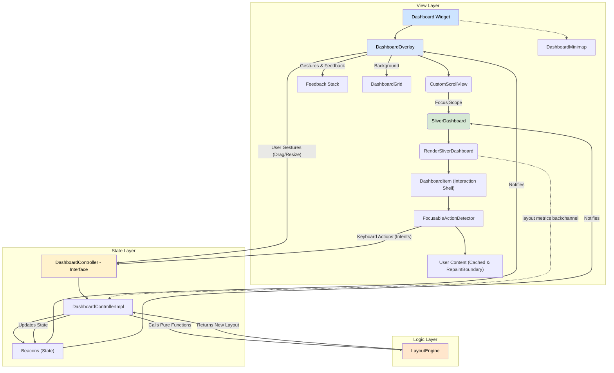
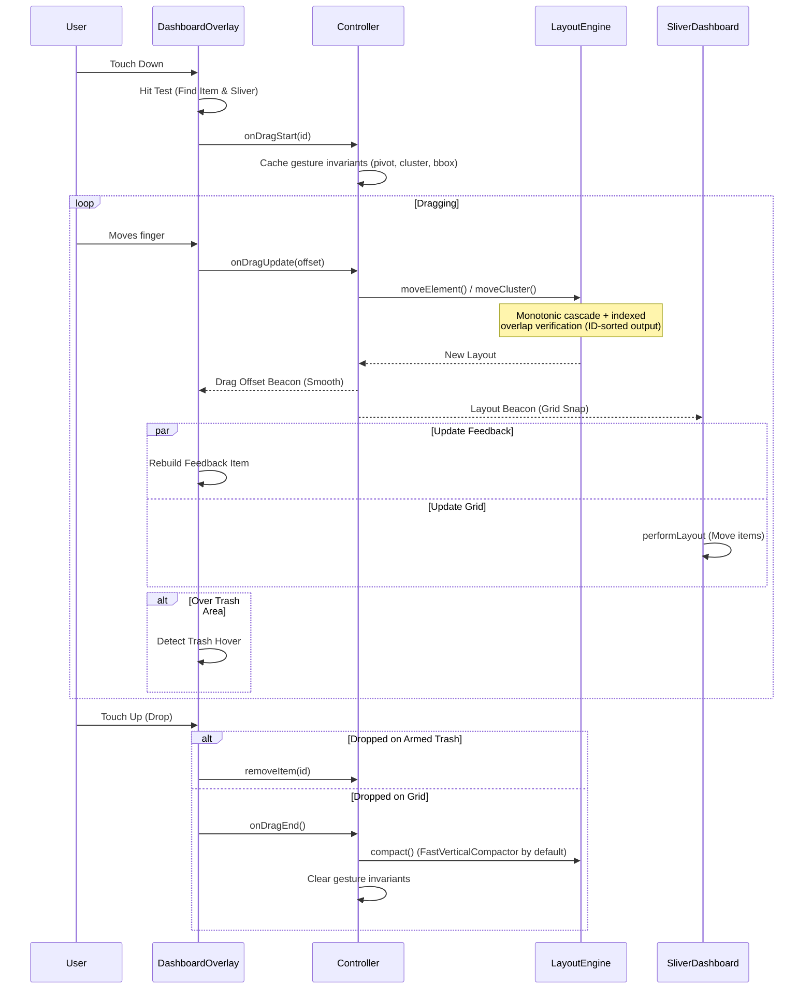
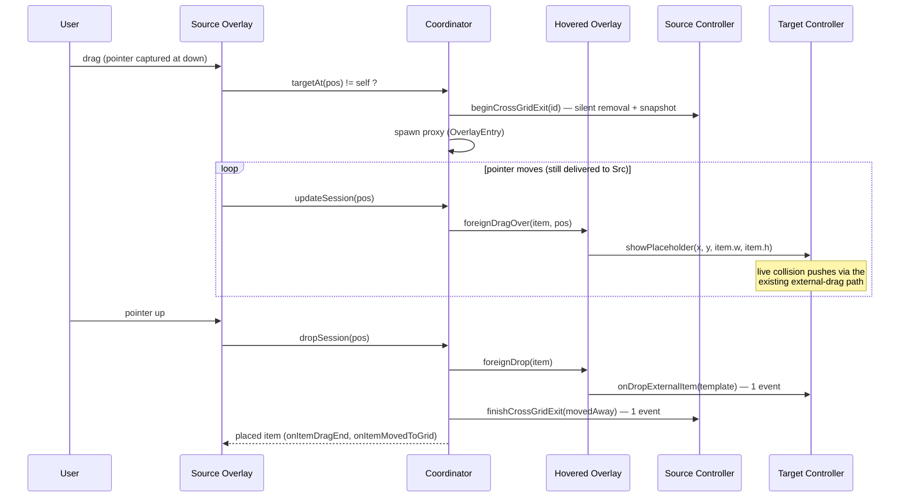

_# Architecture of `sliver_dashboard`

This document outlines the architecture of the `sliver_dashboard` package. It is intended for developers who wish to contribute to the project or understand its internal workings.

## Guiding Principles

The architecture is built on a foundation of modern, idiomatic Flutter principles:

1.  **Declarative UI:** The view layer is a direct representation of the state. We never manually manipulate widgets.
2.  **Reactive State Management:** State is centralized in a controller and exposed as reactive streams (`Beacons`). The UI listens to these streams and rebuilds automatically.
3.  **Separation of Concerns:** The codebase is cleanly divided into three distinct layers: State, Logic, and View.
4.  **Performance First:**
*   **Virtualization:** The core view is built on Flutter's `Sliver` protocol to render only visible items.
*   **Aggressive Caching:** Individual item widgets are cached and protected from unnecessary rebuilds using a "Firewall" widget strategy.
*   **Paint Isolation:** Use of `RepaintBoundary` ensures that layout changes (moving an item) do not trigger expensive repaints of the item's content.
*   **Allocation Discipline:** Per-frame hot paths (drag updates, `performLayout`, minimap paints) must be allocation-free or use reusable scratch buffers. New allocations in these paths are treated as regressions.
5.  **Immutability:** State objects, particularly the `LayoutItem` model, are immutable.
*   **`LayoutItem.extra`**: shallow-equality map (`mapEquals` + `Object.hashAllUnordered` in signature/hash); mutating the map in place is invisible to change detection by design.
6.  **Accessibility (A11y):** The dashboard is designed to be fully usable via keyboard and screen readers, treating accessibility as a first-class citizen, not an afterthought.
7.  **One Rule Per Transform:** any coordinate conversion, projection or resolution that appears at more than one call site must be stated once as an invariant and reused. Duplicated derivations drift silently — see the Content-Origin Convention in §6, which two of five sites had drifted away from by exactly one padding.

## Core Layers

The package is divided into three main layers, each with a distinct responsibility.

### 1. The State Layer (DashboardController)

- **Location:** `lib/src/controller/`
- **Responsibility:** To be the single source of truth for the dashboard's state and to expose a clean, public API.
- **Implementation:**
  - **Interface Separation:** The public `DashboardController` is an abstract interface. The logic resides in `DashboardControllerImpl`.
  - **Multi-Selection State:** Manages `selectedItemIds` (Set) and `isDragging` (bool). The concept of "Active Item" is derived: it is the **Pivot** during a drag, or the primary selection otherwise.
  - **Drag Offset:** Manages a `dragOffset` beacon to provide smooth visual feedback during drags without committing every pixel change to the logical grid layout.
  - **Default Compactor:** The controller defaults to `FastVerticalCompactor` (skyline algorithm, O(N·k)). The legacy `VerticalCompactor` (O(N²·R): measured 1.99M collision checks + 500k list scans per drop at N=1000) remains available via `setCompactor` for behavioral compatibility, but is never the default.
  - **Drag-Start Invariant Caching:** Everything constant for the duration of a gesture (pivot's original item, the dragged cluster's items, the cluster bounding box) is computed **once** in `onDragStart`, cached, and cleared in `onDragEnd` / `cancelInteraction`. `onDragUpdate` must never recompute per-event what is invariant per-gesture.
    - **Consequence — the pivot is immutable mid-gesture.** `replaceItem` / `updateItem` write through to `layout`, `originalLayoutOnStart` and `_crossGridExitSnapshot`, but **not** to these caches. Targeting the active pivot therefore leaves `_pivotItemId` pointing at an id the layout no longer contains and the next `onDragUpdate` throws. This is unreachable through the package's own flows (both `subGridDynamic` arming paths resolve their host with `excludeId: <dragged item>`, and arming requires a single-item selection), so it is enforced by a debug `assert` documenting an application-side contract rather than by rewriting the caches.
  - **Cross-Grid Exit Transaction:** `beginCrossGridExit(ids)` removes items *silently* (temporary removal: internal drag state reset, **no `onLayoutChanged`** — the gesture is still in flight) and snapshots the pre-drag layout. `finishCrossGridExit(outcome:)` resolves it three ways: `movedAway` (commit + exactly one `onLayoutChanged`), `returned` (discard silently — the re-insert path already emitted the final layout), `canceled` (restore the snapshot silently). This guarantees observers see **one event per affected grid, at drop time**.
  - **Template-Preserving External Drop:** `onDropExternalItem(template:)` finalizes a placeholder into a full `LayoutItem`, preserving id, min/max constraints and flags (`onDropExternal` only carries an id). `setItemSize(id, w:, h:)` provides clamped programmatic resizing (used by `sizeToContent`).
  - **`hoveredNestTargetId` beacon:** drives the `subGridDynamic` host highlight; watched only by the light item shells (content stays behind its `RepaintBoundary`).
  - **Layout-Metrics Backchannel:** `viewMainAxisLeadingExtent`, `viewMainAxisContentExtent`, `viewSlotWidth`, `viewSlotHeight` are **plain fields**, written by `RenderSliverDashboard` at the end of every `performLayout`. They are deliberately not beacons: the layout phase forbids notifying listeners. Freshness is guaranteed by ordering — any scroll tick relayouts the sliver before its consumers repaint. Consumers: `DashboardMinimap` (viewport segment mapping) and `DashboardGrid` (geometry fallback tier 2). **They are published on every exit path of `performLayout`, including the empty-layout early return** — skipping one leaves consumers holding the metrics of a previous, different layout.
  - **Orchestrator:** It acts as a bridge. When an action occurs (e.g., `onDragUpdate` or `moveActiveItemBy`). It calculates the delta based on the **Pivot Item** and applies it to the entire cluster via the Engine.
    1. Reads the current state.
    2. Calls the pure `LayoutEngine`.
    3. Updates the beacons with the result.
  - **Layout History (Undo/Redo):** a `UndoRedoBeacon<LayoutSnapshot>` where `LayoutSnapshot` is `({List<LayoutItem> items, int slotCount})`. Two reactive mirrors (`canUndo`, `canRedo`) are published as beacons, and `undo()` / `redo()` emit `onLayoutChanged` before their own `onUndo` / `onRedo`, so auto-save keeps working untouched.
    - **INVARIANT — transactional boundaries only.** `_recordHistory()` is called at seven sites and seven only: `onDragEnd`, `onResizeEnd`, `addItems`, `removeItems`, `importLayout`, `optimizeLayout`, and `updateItem(recompact: true)` outside a gesture. It must NEVER be reachable from `onDragUpdate` / `onResizeUpdate`: at 60 Hz a two-second drag would push 120 full layout copies and allocate 120 x N `LayoutItem` references on the hot path. The gate is a test, not a comment — a 100-frame drag asserting a stack delta of exactly 1.
    - **Content dedupe.** A transaction whose result is content-equal to the cursor entry records nothing, which is what keeps "press, jiggle, drop where it started" (and any no-op compaction) out of the stack.
    - **Snapshots are immutable copies.** `updateItem` patches `_crossGridExitSnapshot` **in place** and `finishCrossGridExit(canceled)` hands that list back to `layout`; storing a live instance would let a later mutation rewrite recorded history.
    - **The column count travels with the items.** `setSlotCount` is deliberately not a boundary (responsive breakpoints are not user edits). Restoration is therefore two-branched: byte-for-byte and **uncompacted** when the counts match — an undo must be the exact inverse of what it reverts, or undo/redo cycles drift — and re-projected through `correctBounds` + `resolveCollisions` when they do not. A cross-breakpoint restoration additionally **writes through to `_layoutsBySlotCount`**: that archive is what `setSlotCount` replays when the grid returns to a count it has already visited, and it was frozen before the restoration. Without the write-through the reverted arrangement comes back on the next window resize — the undo undoes itself. Pinned by a regression test (drag at 8 columns, shrink to 6, undo, return to 8).
    - **Known coupling (documented, asserted).** `UndoRedoBeacon` exposes `canUndo` / `canRedo` as plain NON-reactive getters and `history` as a plain list; its cursor index is private and `historyLimit` is `final`. The controller therefore mirrors the cursor (`_historyIndex` / `_historyLength`), reproducing the beacon's own bookkeeping step for step, and rebuilds the beacon for `clearHistory` / `setMaxHistoryLength`. `_syncHistoryFlags` asserts the mirror and the beacon agree on **every** transition, so a `state_beacon` upgrade that changes the internals fails a test instead of silently mis-restoring.
    - **Reentrancy.** `onWillUndo` / `onWillRedo` may be async, so `undo()` / `redo()` are non-reentrant (`_historyOperationInFlight`) and re-validate the gesture state, the cursor position and the stack identity **after** the await. Restoration prunes selection ids the restored layout no longer contains — a dangling id makes the next `onDragStart` throw on `firstWhere`.
    - **Zero-cost opt-out (`maxHistoryLength: 0`).** `_recordHistory()` returns on its first statement, before the `_layoutsEqual` scan and before any copy; `_layoutHistory` is never instantiated. The invariant is `_layoutHistory != null` **exactly when** `_maxHistoryLength > 0`, which is why every read is guarded by that predicate rather than by a null test — a null test would leave an unreachable else branch. Both runtime transitions are explicit: disabling disposes the beacon, nulls it, zeroes the mirror and **publishes** `canUndo`/`canRedo` as false (an app watching them must see the transition, not keep a dead button); re-enabling seeds a fresh stack from the live layout, since nothing was recorded while it was off.
    - **Scope.** Cross-grid drops (`onDropExternalItem`, `finishCrossGridExit`) are NOT recorded: history is per controller, and undoing one side of a two-grid move would duplicate the item.
  - **`maxRows`**: enforced at the four user-driven placement choke points (drag clamp, interactive resize clamp on the anchored axis, setItemSize, bounded placeNewItems search with below-cap fallback). Push cascades are not truncated: rejecting a cascade would require speculative simulation per pointer event.

### 2. The Logic Layer (LayoutEngine)

- **Location:** `lib/src/engine/layout_engine.dart`
- **Responsibility:** To perform all pure, CPU-intensive layout calculations.
- **Implementation:**
  - A library of top-level, pure functions (e.g., `compact`, `moveElement`, `resizeItem`).
  - **Decoupled:** Has no knowledge of Flutter widgets or the controller. Operates purely on the `LayoutItem` data model.
  - **Deterministic:** Given the same input layout and parameters, it always returns the same output layout.
  - **Cluster Logic:** Handles group movements by calculating a **Bounding Box** for selected items. The engine moves this virtual box against obstacles and applies the resulting delta to all items in the cluster.
  - **Strategy Pattern:** Compaction logic is delegated to a `CompactorDelegate`. Default implementations (`VerticalCompactor`, `HorizontalCompactor`, `FastVerticalCompactor`) are provided, but can be swapped at runtime.
  - **Overlap-Free Invariant:** `moveElement` uses a **monotonic re-push cascade** (items may be re-queued when pushed again, instead of a one-shot `processed` set) followed by an O(N·k) verification pass over a row index (`_RowIndex`). The unconditional O(N²) all-pairs `resolveCollisions` safety net was removed from the per-crossing hot path (499,500 pair checks at N=1000 → ~16,000 indexed checks, 31× fewer). Property (fuzz-tested, 200 seeded dense layouts): **the returned layout contains zero overlapping non-static items.**
  - **Axis Asymmetry (INVARIANT):** the overlap-free property above is earned from **monotonicity**, and monotonicity is free only on an **unbounded** axis: a vertical cascade pushes down and never comes back. The horizontal axis is finite, and both `_compactItemHorizontal` and `_resolveCollisionsDefault` resolve an overflow by **wrapping** to `(x: 0, y: y + 1)` — which lets an item re-enter a row whose left side is already settled. Two consequences, each load-bearing:
    1. `_resolveCollisionsDefault` takes `cols` and **wraps rather than clamps**. Clamping to `cols - w` would put the item back onto the obstacle it was just pushed off, trading a bounds violation for an **overlap** violation, which is strictly worse — zero overlap is what every consumer relies on.
    2. The O(N·k) residual-overlap verification runs whenever the axis is bounded (`preventCollision || compactType == horizontal`), not only when `preventCollision` is set. Gating it on `preventCollision` alone was an optimization resting on the monotonicity argument, which does not transfer between axes; horizontal drags returned overlapping layouts as a result.
    The added cost is confined to horizontal compaction: the vertical path is byte-identical. Both points are covered by the seeded fuzz across all three modes plus `test/engine/horizontal_bounds_repro_test.dart` and `test/engine/horizontal_overlap_repro_test.dart`.
  - **Static-Jump Correctness:** When the moved item jumps over a static obstacle, collision resolution restarts from the item's **new** position; stale collision lists computed for the pre-jump position must never be consumed (`break` after re-queue).
  - **Index Stability Invariant:** Every engine function that returns a layout preserves **ascending ID order**, including `moveCluster` (which previously appended the dragged cluster at the tail).
    - **Why it still matters:** this is the canonical order the controller, the tree codec and `_reconcileLayouts` (breakpoint layout caching) diff against. Breaking it makes layout comparison, breakpoint reconciliation and exports non-deterministic.
    - **Why the historical justification is obsolete:** sliver element identity no longer depends on it. Since the geometric child ordering was introduced (§Geometric child ordering), the view feeds the sliver a *reordered* view on every collision push, and identity is carried by per-id cached `ValueKey`s plus `findChildIndexCallback`. Do not restore the "full remount churn / `finalizeTree`" rationale — it is no longer true and misleads readers.
  - **INVARIANT — No Cluster Duplication:** `moveCluster` must guarantee that selecting pure static items alongside dynamic items does not result in duplicated elements in the final layout. Static items are treated as immovable obstacles within the collision path and are naturally returned by the coordinate solver; they must never be appended a second time (avoiding `ValueKey` crashes in the sliver).
  - **Policy symmetry (application contract):** a `DashboardPolicy.canCollide` implementation must be symmetric. The engine's argument order is an implementation detail of the cascade direction; an asymmetric policy (`itemB.hasNestedGrid` only) makes push behaviour depend on which side the cascade reaches first.

### 3. The View Layer (Overlay & Slivers)

- **Location:** `lib/src/view/`
- **Responsibility:** To render the state efficiently, handle user gestures, and manage focus/accessibility.

The view layer has been refactored to support native Sliver composition. It is composed of three key widgets (plus, **[NESTED]**, the nested-grid layer described in §7: `DashboardNestedScope`, `DashboardNestedCoordinator`, `NestedDashboard`):

#### A. `DashboardOverlay` (The Interaction Layer)
- **Role:** Handles all pointer interactions (Gestures), visual feedback (Drag placeholders, Resize handles), Auto-scrolling, and the Trash bin.
- **Placement:** It must wrap the `CustomScrollView`.
- **Logic:**
  - **Global Key:** Uses a unique `GlobalKey` on its internal `Stack` to strictly identify the viewport boundaries for hit-testing and auto-scrolling.
  - **Content-Origin Arithmetic:** the overlay converts between grid-content coordinates and overlay-local coordinates using the single rule stated in §6 (Content-Origin Convention). It does **not** use `getTransformTo`/`MatrixUtils` — an earlier revision of this document claimed it did, while every call site computed the transform arithmetically, and two of them double-counted the leading padding as a result.
  - **Overlap-Aware Clipping:** dynamically calculates a `ClipRect` for the feedback item that respects `SliverConstraints.overlap` (e.g., sliding under a pinned `SliverAppBar`).
  - **Web Throttle Flush:** The 16 ms pointer-event throttle used on web keeps the freshest position and flushes it on a short timer, so the item never settles one event behind the cursor at the end of a burst.
  - **`CrossGridDragTarget`:** the overlay state implements this interface so the nested-grid coordinator can drive it (`foreignDragOver`/`foreignDragLeave`/`foreignDrop`, `itemAtGlobal`, `currentSlotMetrics`, highlight). It registers with the nearest `DashboardNestedScope` in `didChangeDependencies` (depth = number of enclosing dashboards) and unregisters on dispose.
  - **Hit-Test Ownership:** `_hitTest` filters hit-path entries by **sliver ownership**. The hit-test path is deepest-first, so with nested grids the first `SliverDashboardParentData` under the pointer may belong to an *inner* grid; without the filter the outer overlay would start a drag on a foreign item id (StateError). Entries from foreign slivers are skipped and the walk naturally reaches the overlay's own host item.
    - **Documented consequence:** when the child grid is **not** editing, its `_onPointerDown` returns before claiming the pointer and the walk reaches the host — so the parent drags the panel. Intentional (iOS-folder feel) and pinned by a test, but it is a by-product of an early return rather than an explicit decision, and it is the most frequent integration surprise. Applications must propagate their edit state to the child controller.
  - **Pointer Claim & Target Exclusions:** on pointer-down, the deepest overlay that actually starts an operation claims the pointer at the coordinator; ancestor overlays check `isPointerClaimedByOther` first and skip (Flutter dispatches pointer events deepest-first, so the claim is always set before ancestors run).
    - **Do not pre-claim on raw pointer-down.** On mobile the competing `LongPressGestureRecognizer`s already resolve in the gesture arena (the innermost arms its deadline first and closes the arena on acceptance), so there is nothing to fix; and a claim taken at pointer-down leaks — the mobile-tap branch of `onPointerUp` bypasses `_onPointerUp`, hence `releasePointer`, locking ancestors out permanently after a plain tap.
    - **The armed-clone exception.** An Alt+drag arms a duplication at pointer-down WITHOUT starting an operation (see §6, Alt+Drag Duplication). It still claims the pointer — an ancestor would otherwise drag the host tile out from under the armed gesture — which reopens exactly the leak above for one path: the mobile-tap branch. `_handleMobileTap` therefore releases an armed-but-unresolved clone explicitly. This is the ONE place where a claim exists without a live operation, and it must stay paired with that release.
  - **Sliver Resolution:** `_findRenderSliver` caches the resolved render object while it stays attached, using a **local** search sentinel and, when a `sliverKey` is supplied, a walk strictly scoped to that key's subtree with **no unscoped fallback** — see §6 (Sliver Resolution) for why both properties are load-bearing.
  - **Placeholder Refactor:** `_updatePlaceholderPosition` (the `DragTarget` external-drop path) now delegates to `_gridPointAtGlobal` + `_showPlaceholderAt(w:, h:)`, shared with cross-grid drags so both flows use the exact same geometry and clamping.
  - **Content-Origin Site Consolidation (`_contentOriginOf`):** the drag-feedback layer and the rubberband layer resolve the content origin and the sliver clip band through **one** method. This is the §6 convention applied to the layers painted above the scroll view; a second copy of that arithmetic is what produced the historical one-padding offset, and any new layer reuses this instead of re-deriving it.
  - **`canAcceptItem` (per-grid drop rules):** `DashboardNestedCoordinator.targetAt` applies the scope's predicate as its LAST rejection, after containment and `canAcceptCrossGridItems`, so user code runs only for the one or two grids actually under the pointer. A refusal is a `continue`, never a `return`: the loop keeps going and the enclosing grid wins the depth comparison, which is what makes a refusing sub-grid transparent instead of a dead zone. The filter is applied at BOTH `targetAt` call sites — the coordinator's in-session probe and the overlay's session-entry probe — and at `hasAnyTargetBesides`, because a scope where every other grid refuses the item must not open an exit session at all. It is skipped entirely when no `draggedItem` is passed, keeping non-drop "which grid is here?" queries unfiltered. There is no per-overlay override by design: the predicate is consulted while resolving which grid owns the pointer, i.e. before any grid does.
  - **Swap drag mode:** `_handleModifierKey` mirrors the swap modifier into `DashboardController.swapModifierHeld` and, when the flip actually changes the effective mode of a LIVE single-item drag, replays `_performUpdate(_lastGlobalPosition)` so the layout reflects the new mode without any pointer movement. Two details are load-bearing: the state is **seeded at drag start** (a key already held when the drag begins emits no key event, so the handler would never see it), and the replay is **guarded on a real mode change** so an unrelated keystroke mid-drag costs nothing.
  - **Rubberband ("lasso") selection** (configured by `DashboardController.lassoStyle`, alongside `shortcuts` and `guidance` — it is interaction policy, not grid painting, so it stays reachable on a grid with no background and is per-controller in a nested tree): a press on empty grid space ARMS a selection rectangle (`_pendingLassoStart`) and resolves it on the first move past `_dragMoveTolerance` (`_startLasso`) — the same two-phase shape as the Alt+drag clone, for the same reason: `_onPointerDown` fires on the raw button press, so committing there would make every click on the background a selection wipe. Five properties are load-bearing:
    1. **The anchor lives in grid-content space** (`_lassoAnchorContent`), not overlay-local or global pixels. That is what keeps the rectangle pinned to the content across edge auto-scroll and mouse-wheel scrolling (a `ScrollController` listener re-projects it), and it is also the space the intersection needs, since items are grid-addressed.
    2. **The selection beacon is written only when the resolved id set changes.** `Set` has identity equality in Dart, so an unguarded write notifies on every pointer event and rebuilds every visible item shell at pointer frequency. The O(N) scan itself is cheap (~6k comparisons at N=1000); the guard is what makes the feature free. The per-event scratch buffer (`_lassoHitScratch`) is reused, so a frame that changes nothing allocates nothing.
    3. **It claims the pointer while merely armed.** Second and last exception to the "do not pre-claim" rule, alongside the armed clone: without it, a lasso on a nested grid's background lets the parent overlay drag the host tile at the same time (its `_hitTest` walk reaches the host). Paired with the release in `_resetOperationState`, which every pointer-up path reaches through its `finally`; the mobile-tap branch is not a leak path here because the lasso is never armed on touch platforms.
    4. **The cursor comes from an ANCESTOR `MouseRegion`, paired with a cursor floor on the tile.** Flutter resolves the cursor from the innermost non-deferring region on the hit path, which keeps the lasso cursor over empty space with zero hit tests and zero per-hover work — but only because `DashboardItemWidget` annotates the tile with `SystemMouseCursors.basic`. Both MouseRegions a tile already contained (`FocusableActionDetector`, `GuidanceInteractor`) build with no cursor and therefore DEFER, so without that floor the resolver walks past the tile and the lasso cursor is what tiles would show. Deeper regions (resize handles, application content) still win: it is a floor, not an override. Its `child` is pre-built and handed through the `ValueListenableBuilder`, so a modifier press rebuilds the region and nothing under it. Because key state changes emit no pointer event, a `HardwareKeyboard` handler mirrors the modifier into `DashboardController.lassoModifierHeld` (desktop only, two `Set.contains` per key event) — a beacon rather than a local notifier, symmetric with `swapModifierHeld`, so one `Builder` observes both it and `isEditing` instead of nesting a second builder, and applications can drive a mode indicator from it. The painted rectangle stays a private `ValueNotifier` by contrast: it is per-gesture view state consumed by exactly one widget, the same shape as the cross-grid proxy's own position notifier.
    5. **The painted frame is a plain `ValueNotifier<LassoOverlayState?>`, not a beacon.** Nothing outside the overlay consumes it and it must not enter the controller's reactive graph. `LassoOverlayState` has value equality so `LassoPainter.shouldRepaint` short-circuits, and the layer sits behind its own `RepaintBoundary`: a lasso drag repaints two `drawRect`s and nothing else.
    - **Screen-reader announcements are not opt-in.** `guidance == null` disables the cursor change and the on-screen label; `a11yLassoStart` / `a11yLassoEnd` still fire from `DashboardGuidance.byDefault`.
- **Slot gestures**: `_handleSlotGesture` reuses the drag pipeline's
  `SlotMetrics.pixelToGrid` with
  `offset = viewportScroll - precedingScrollExtent + padding.top` (reduces
  to the plain scroll offset for a single grid — `pixelToGrid` subtracts
  `padding.top` itself, so the two cancel; this is the one place where the
  main-axis padding legitimately appears). Containment = strict
  sliver bounds, relaxed to the remaining viewport under `fillViewport`
  (which only exists in single-grid setups).

#### B. `SliverDashboard` (The Rendering Layer)
- **Role:** Renders the actual items within the scroll view using the Sliver protocol.
- **Logic:**
  - **Focus Scope (Parent):** The parent `Dashboard` widget wraps the `CustomScrollView` in a `FocusTraversalGroup` with `OrderedTraversalPolicy` to ensure Tab navigation follows the visual grid logic (Row-major order).
  - **Responsive Logic:** Handles `breakpoints` internally using "Skip Frame" optimization.
  - **Item Persistence:** Unlike standard drag-and-drop lists, items being dragged are **NOT removed** from the tree. They are rendered with `Opacity(0.0)`. This is crucial to preserve their `FocusNode` state during keyboard interactions.
  - **Identity Guards (render-object contract):** The `items` setter no-ops when the incoming list is `identical` to the current one (the controller emits a new instance only on real layout changes).
    - **Scope of the guarantee:** it is a *render-object* contract, not a widget one. `SliverDashboard` wraps its content in a `SliverLayoutBuilder`, and `_LayoutBuilderElement.update` calls `renderObject.markNeedsLayout()` unconditionally on every widget update — so no widget-level rebuild can ever skip a layout pass, with or without the trailing `markNeedsLayout()` in `SliverDashboardLayout.updateRenderObject` (which is therefore redundant, not harmful). What the guard actually buys: it gates the reflow seed pass (a scroll relayout must not animate anything) and keeps direct render-object updates cheap.
    - **Slot-count keying:** the `SliverLayoutBuilder` carries `ValueKey('sliver-layout-builder-$slotCount')`, so **any slot-count change rebuilds a brand-new `RenderSliverDashboard`**. Anything caching that render object from outside the subtree (notably `DashboardGrid`) must be able to re-resolve it.
  - **Key Cache:** item `ValueKey`s are cached per item id and reused across frames; the Key→Index map is updated **in place** on a pure reorder (same id set, new positions), and rebuilt only on a structural change. The geometric view (below) reorders the layout on every collision push, so the previous "same ID sequence" fast path missed on exactly the frames where the engine is busiest and rebuilt N `ValueKey`s + N interpolated strings + one N-entry map. The cache is cleared when `itemGlobalKeySuffix` changes (the keys embed it) and pruned when it drifts past twice the live item count.
  - **Delegate Identity & Child Rebuilds (Framework Contract):** `SliverDashboard.build` creates a new `SliverChildBuilderDelegate` on every build pass. Because Flutter's `SliverChildBuilderDelegate.shouldRebuild` returns `true` unconditionally, `SliverMultiBoxAdaptorElement.update` calls `performRebuild()`, executing `updateChild` on the $V$ mounted child widgets whenever `SliverDashboard` rebuilds (e.g. from ancestor state changes). Heavy user content remains completely shielded from GPU repaints by the `RepaintBoundary` firewall inside `DashboardItem`. Memoizing the delegate instance is deliberately avoided to prevent silent stale-closure bugs.

#### C. `RenderSliverDashboard` (The Engine Room)
- **Role:** Implements `RenderSliverMultiBoxAdaptor` to perform the actual layout and painting.
- **Virtualization:** Only lays out and paints items that are currently visible in the viewport.
- **Allocation Discipline:** item geometry is computed into a reusable `Float64List` scratch buffer (`[left, top, width, height]` per item) instead of allocating a `List<Rect>` per layout pass (previously ~60k short-lived `Rect`s per second during autoscroll drags at N=1000, a measurable dart2js minor-GC source). Paint offsets are two `double` fields in `SliverDashboardParentData` rather than an `Offset` per child per pass, and `BoxConstraints` are reused per child (`parentData.tightFor`) while the size is unchanged — a scroll relayout re-lays out every visible child at the exact same size, and `RenderObject.layout` compares constraints by value, so reusing the instance changes nothing else. The pass therefore allocates exactly **one** object: the `SliverGeometry` the protocol mandates.
- **`parentData` casts are unconditional:** `child.parentData! as SliverDashboardParentData` is sound inside the pass. `setupParentData` replaces any non-conforming parent data, the framework calls it in `adoptChild` for every inserted child, `indexOf` already hard-casts one line earlier, and `remove` unlinks the child before `dropChild` nulls the field. A defensive `is` check leaves an unreachable else branch.
- **Layout Protocol (Critical):** The `performLayout` method manages a **doubly linked list** of children. It strictly follows this sequence to ensure stability (the buffer change does **not** alter this order):
  1.  **Metrics:** Calculate slot sizes based on constraints and aspect ratio — **before** the empty-layout early return, so the metrics backchannel is published on every exit path.
  2.  **Garbage Collection:** Remove invisible children *before* insertion to clear invalid references.
  3.  **Initial Child:** Find and insert the first visible item based on scroll offset.
  4.  **Fill Trailing/Leading:** Insert remaining visible items outwards from the initial child.

#### D. `DashboardItem` (The Smart Wrapper)
- **Role:** The atomic unit of the grid. It handles Caching, Focus, Accessibility, and Visual Decoration.
- **Structure:**
  - **Outer Shell:** `FocusableActionDetector` handling keyboard shortcuts and focus states. Rebuilt on state changes (Focus/Grab).
  - **Inner Core:** Cached User Content wrapped in `RepaintBoundary`.
- **Allocation-Free Shell Rebuilds:** The `Actions` map (4 `CallbackAction` closures) is built once per `State` (`late final`); actions read live controller state at invoke time. Shortcut maps are cached per `DashboardShortcuts` config instance (active + idle variants). Shell rebuilds during drags allocate nothing.
- **Keep-Alive Trade-off (documented):** `wantKeepAlive = isDragging` prevents unmount thrash at the cache edge, but during a long autoscroll drag the keep-alive bucket can grow toward N items, released in one `finalizeTree` burst after the drop. If profiling shows this, scope keep-alive to the dragged cluster + recently laid-out items (re-exposes flicker for non-cluster items; gate behind measurement).

#### E. Internal Components
- **`DashboardItemWrapper`:**
  - **Role:** The final visual layer before the user's content.
  - **Logic:** Adds visual decorations needed for editing, such as the **Resize Handles**.
  - **Integration:** Wraps the content in a `GuidanceInteractor` if guidance is enabled.
- **`GuidanceInteractor`:**
  - **Role:** Handles contextual user guidance.
  - **Logic:** Detects hover (desktop) and tap/long-press (mobile) events to display contextual guidance messages.
  - **Conflict Management:** Manages gesture conflicts on mobile to ensure drag operations are not blocked.
- **`DashboardGrid` (background host):** resolves the sliver and hands the painter **value-typed scalars**. It owns the three-tier geometry resolution and the one-shot post-frame retry described in §6.
- **`GuidanceBubble`:** the shared visual shell of every guidance message. `GuidanceInteractor` still owns *when* and *where* an item bubble appears (anchored to a `LayoutItem` through a `LayerLink` inside an `OverlayEntry`); the lasso label has no item to anchor to and is painted in-tree, so only the appearance is shared.
- **`DashboardLassoLayer` / `LassoPainter`:** the rubberband layer. Driven by a `ValueListenable<LassoOverlayState?>` published by the overlay, wrapped in `IgnorePointer`, and collapsed to a `SizedBox.shrink()` when no lasso is in flight. It performs **no coordinate math**: the overlay owns the content-origin arithmetic and hands it an overlay-local `Rect` plus the sliver clip band.
- **`GridBackgroundPainter`:** a pure function of value-typed inputs — `SlotMetrics` implements value-based `==`/`hashCode`, and the sliver geometry enters as two plain `double`s (`sliverLayoutStart`, `sliverContentExtent`) so `shouldRepaint` can short-circuit soundly. The row-line loop is bounded by the clip rect instead of a hard-coded 10,000 px extent (~80–150 mostly-clipped `drawLine` commands per repaint reduced to the visible ~10–20).
  - **Why it must not hold the `RenderSliverDashboard`:** a render-object reference is stable across mutations of its own `constraints`/`geometry`, so `shouldRepaint` cannot detect them. An earlier revision passed the render object; when the lookup went stale the painter kept a zero main-axis origin **permanently**, painting the background one padding too high, and no repaint could correct it. Handing it scalars turned a permanent misalignment into, at worst, a one-frame one.

#### F. DashboardMinimap (Visualization Tool)
- **Role:** Provides a "bird's-eye view" of the entire dashboard layout and the current viewport.
- **Two-Layer Painting:** The minimap is split into:
  - `_MinimapItemsPainter` behind its own `RepaintBoundary`, repainted **only** when the layout list instance changes, batching all item rects into two `drawPath` calls (previously up to 1000 individual `drawRRect`s per drag cell-crossing);
  - `_MinimapViewportPainter` constructed with `super(repaint: scrollController)`, so the viewport indicator repaints on scroll **without** rebuilding the widget. This also fixes the stale-indicator bug (the indicator previously did not track scrolling because `shouldRepaint` ignored the scroll offset).
- **Scaling:** Automatically scales the logical grid dimensions to fit the widget's constraints while maintaining the aspect ratio.
- **Interaction:** Supports "Scrubbing" (Tap/Drag) to instantly scroll the dashboard to a specific position. It calculates the inverse ratio (Minimap Pixel -> Scroll Offset) to perform the jump.

## 4. Accessibility Architecture

The package implements a comprehensive A11y strategy based on Flutter's `Actions` and `Intents`.

- **Intents:** Abstract user intentions (`DashboardGrabItemIntent`, `DashboardMoveItemIntent`, `DashboardDropItemIntent`).
- **Shortcuts:** A configurable map binding keys to Intents (e.g., `Space` -> `Grab`, `Arrows` -> `Move`). This is customizable via `DashboardShortcuts`.
- **Actions:** The logic executed when an Intent is triggered. These call the Controller methods (`moveActiveItemBy`, `cancelInteraction`). **[AUDIT]** Action instances are per-`State` singletons; they must read live state at invoke time, never capture per-build state.
- **Announcements:** Integration with `SemanticsService` to announce state changes (Selection, Movement coordinates, rubberband start and resulting count) to screen readers. Messages are customizable via `DashboardGuidance`. **They are not gated on `guidance != null`** — a null guidance disables the visual affordances (tooltips, cursors) only, and the built-in English defaults are announced instead.

## 5. Performance Optimization Strategy

The biggest challenge in a grid layout is preventing the reconstruction of child widgets when the parent layout changes (e.g., resizing the window or dragging an item). `sliver_dashboard` solves this using a **Smart Caching** strategy:

1.  **Content Isolation (The Firewall):**
- The expensive part (the user's widget provided via `itemBuilder`) is cached in a local state `_cachedWidget`.
- **Smart Invalidation:** In `didUpdateWidget`, the system compares the `contentSignature` of the new item vs. the old item.
  - **Rule:** `contentSignature` is a hash of properties that affect *content* (width, height, id, static status, `hasNestedGrid`, and the `extra` business-metadata map — shallow-hashed) and **crucially ignores** position changes (`x`, `y`).
- If the signature matches, the cached widget instance is returned. Flutter detects `oldWidget == newWidget` and stops the rebuild propagation immediately.
- **Breakpoint hoisting**: `DashboardItem.didUpdateWidget` resolves old-vs-new breakpoints itself on the breakpoint-only path and keeps the outer cache when unchanged; `DashboardBreakpointBuilder`'s inner guard remains as defense in depth.
- **Edit-mode toggles are deliberately NOT an invalidation cause**. The edit chrome (handles, borders, gestures, a11y) lives OUTSIDE the cache and adapts on its own, so toggling is nearly free even with heavy tile subtrees. Content that depends on the edit state must read it reactively (`controller.isEditing.watch(context)` inside the tile — state_beacon is re-exported by the barrel for this). Contract is pinned by a test.
- **Displaced Item Highlighting**: When an active drag pushes neighboring items, `item.moved == true` triggers `displacedDecoration` / `displacedColor` on the outer shell without invalidating the cached user content subtree (`_cachedWidget`).

2.  **Lazy Loading:**
- **Rule:** The cache is initialized lazily in the `build()` method (not `initState`). This ensures that `InheritedWidgets` (like `Theme` or `Provider`) are accessible during the first build, preventing runtime errors.

3.  **Shell Reconstruction:**
- The "Interaction Shell" (border, focus detector, semantics) is rebuilt frequently (e.g., when gaining focus or being grabbed).
- Because the heavy user content is cached and wrapped in `RepaintBoundary`, rebuilding the shell is extremely cheap (sub-millisecond).

4.  **RepaintBoundary:**
- When an item moves, the cached widget tree includes a `RepaintBoundary` wrapping the user's content. The GPU simply translates the existing texture without repainting the pixels of the child widget.

5.  **Measured Hot-Path Budgets (N=1000, 8 columns, 2×2 items):**
- Drag cell-crossing: ≤ ~20,000 collision checks total (indexed verification), vs 499,500 all-pairs checks pre-audit. Top-of-grid drags additionally traverse up to ~250 cascade queue steps (bottom: 1) — this asymmetry is inherent to push-based grids and is bounded, not eliminated.
- Drop compaction (default compactor): O(N·k) skyline; regression threshold in CI: < 50 ms at N=1000 on the test runner.
- `performLayout`: one `SliverGeometry` per pass (protocol-mandated) and **zero** per-child allocations; the scratch buffer grows amortized. An earlier version of this document claimed "zero heap allocations", which is unsatisfiable — `SliverGeometry` is immutable and required once per pass. An impossible budget guarantees nothing and hides real regressions.
- Mutation passes additionally pay the geometric view: O(N log N) plus **one** N-element list. The copy cannot be a reused scratch buffer, because the render object's `items` setter relies on instance identity to detect real changes.
- Minimap during drags: 2 `drawPath` calls for items; viewport indicator repaints only on scroll.

### Performance Budgets & CI Runhead Safety Ceilings

To ensure that the `sliver_dashboard` package maintains a strict 60 FPS target during high-frequency interactions, test suite enforces automated performance budgets.

While local AOT release builds execute these computations in sub-millisecond durations, CI validation thresholds are set to **50ms**, **35ms**, and **15ms** respectively. These values are designed as engineering safety ceilings to absorb system-level execution noise while preventing false positives.

#### Drop Compaction Budget (`< 50ms` for N = 1000 items)
When viewport column boundaries change, the layout organizer must reorganize all elements.
* **The CI Headroom:** Shared virtualized CI runners (e.g., GitHub Actions, GitLab CI) are heavily throttled and non-deterministic. A cold-start JIT execution taking 2ms locally can spike to 15–20ms under shared runner congestion.
* **The Fail-Safe:** Setting the budget to 50ms absorbs virtualized runner noise to **prevent flaky tests** (false positives), yet serves as an immediate circuit breaker: if a contributor accidentally introduces an O(N^2) or O(N^3) algorithm, the computation for 1,000 items will balloon to **250ms–1000ms+**, immediately failing the CI build.

#### Cascade Push Budget (`< 35ms` for N = 500 items)
Moving a cluster into a dense grid triggers a cascading push sequence strictly along column boundaries.
* **OS Clock Resolution Constraints:** On some operating systems (notably Windows runners), the default system clock tick resolution (`Stopwatch`) progresses in discrete steps (tied to the OS kernel interrupt frequency).
* **The Fail-Safe:** Setting the budget to 35ms ensures that OS clock-tick jitter cannot fail the test suite, while validating that row-indexed spatial index (`_RowIndex`) remains active. If the index is broken, the cascade engine falls back to O(N^2) pairs scanning, easily exceeding the 35ms ceiling.

#### Cross-Grid Target Selection Budget (`< 15ms` for N = 1000 items)
While a cross-grid drag is active, the coordinator must resolve which target grid is under the cursor on every pointer move event.
* **The Complexity Guarantee:** The `targetAt` method must maintain O(G) complexity (where G is the number of live grids under the scope) and **never** degrade to O(N) linear scans of all items. The dimension-projection memo key must likewise stay O(1) and allocation-free — it reads the controller's published slot sizes (plain doubles), never `currentSlotMetrics()`, which allocates.
* **The Fail-Safe:** In a dense layout of 1,000 items, an O(N) scan would cause massive CPU spikes on every touch move. A 15ms budget on JIT execution ensures that we are only performing point-in-rect tests on registered overlays, completely bypassing individual item coordinate checks. This guarantees microsecond-level execution in production while remaining resilient to CI runner scheduling overhead.

## 6. Core Technical Patterns

### Coordinate Separation
The system strictly separates logical grid coordinates from visual pixel coordinates to maintain precision.
- **Engine:** Operates strictly in **Grid Coordinates** (`int x, y`). It never sees pixel values.
- **View:** Handles translation to **Pixel Coordinates** (`double offset`) using `SlotMetrics`.

### Content-Origin Convention (INVARIANT)

`Dashboard` composes `CustomScrollView → SliverPadding(padding) → SliverDashboard`.
`RenderSliverEdgeInsetsPadding` forwards
`precedingScrollExtent: beforePadding + constraints.precedingScrollExtent` to its
child, so `RenderSliverDashboard.constraints.precedingScrollExtent` **already
contains the leading main-axis padding**.

One rule, applied identically by every site that converts between grid-content
coordinates and overlay-local coordinates:

- **main axis** — `origin = precedingScrollExtent - scrollOffset`. Never add
  `padding.top` / `padding.left` on top of it.
- **cross axis** — `origin = padding.left` / `padding.top`. The cross-axis
  padding is not part of the scroll extent and IS added manually.

The five sites bound by this rule: `GridBackgroundPainter` (via the scalars
resolved by `DashboardGrid`), `DashboardOverlay._buildFeedbackLayer`,
`_gridPointAtGlobal`, `_isInsideSliver`, `_handleScrollRequest`. A divergence
between any two of them is a bug — and was one: the feedback layer and
`scrollToItem` double-counted the leading padding, so the dragged copy sat one
padding away from the real tile for the whole gesture (a constant offset; the
scroll terms cancel) and `scrollToItem` over-scrolled by the same amount. The
error is exactly **zero pixels on a padding-free grid**, which is the only
configuration the test suite exercised — hence months of 100% line coverage over
a live defect. Any new site must reuse an existing one rather than re-derive.

The single legitimate exception is `_handleSlotGesture`, which adds `padding.top`
to the offset it feeds `SlotMetrics.pixelToGrid` *because `pixelToGrid` subtracts
it again*; the net is zero.

### Sliver Resolution (INVARIANT)

`DashboardOverlay` and `DashboardGrid` both live in the overlay's `Stack`,
outside the scroll view's subtree, and both need the `RenderSliverDashboard`.
Their `_findRenderSliver` implementations must:

1. **Use a local search sentinel**, never the cached field. Reading the field as
   the "already found" guard turns the whole walk into a no-op the moment the
   field holds a stale detached object — and it does, on **every slot-count
   change**, because `SliverDashboard` keys its `SliverLayoutBuilder` on the slot
   count and rebuilds a brand-new render object while these `State`s survive.
   `NestedDashboard(autoSlotCount: true)` triggers this on its first frame.
2. **Never fall back to the unscoped walk when a `sliverKey` was given.** The
   key's context is null for a frame at mount (these `State`s are *siblings* of
   the scroll view, built before it), and the unscoped walk returns the **first**
   `RenderSliverDashboard` under the shared overlay stack — a sibling grid's. That
   reference is attached, so the cache guard would lock it in forever: the
   background would paint a foreign origin, and in the overlay `_hitTest` would
   stop matching its own items (`identical(parent, ownSliver)` never true), which
   disables dragging entirely for that grid.
3. **Never cache a stale reference in preference to `null`.** The fallbacks below
   are exact; a detached render object degrades to nothing.

### Background Geometry Resolution & the Two-Pass Dependency

`DashboardGrid` resolves the two main-axis scalars the painter needs in three
tiers of decreasing precision:

1. the live sliver `constraints`/`geometry`;
2. the controller's published metrics (`viewMainAxisLeadingExtent`,
   `viewMainAxisContentExtent`) — exact, and valid while the render object is
   momentarily unreachable;
3. the enclosing `SliverPadding`'s leading extent — exact for a single-grid
   composition, approximate when other slivers precede this one.

Two consequences worth internalising:

- **The background is child 0 of the overlay's `Stack`; the `CustomScrollView` is
  child 1.** On the frame both are first built, no `RenderSliverDashboard` exists
  and `performLayout` has not run, so tiers 1 and 2 are both unavailable. A grid
  that never scrolls emits no notification afterwards and nothing would rebuild
  this subtree, so tier 1 would be unreachable **forever** for a static grid.
  Exactly one post-frame `setState` retry is scheduled, guarded by a flag cleared
  only on success: bounded to one extra build per failure episode and provably
  non-looping (a composition with no `SliverDashboard` settles after one retry —
  `pumpAndSettle` would time out otherwise). This is a genuine two-pass layout
  dependency, not a workaround; Flutter offers no cleaner mechanism here, since
  publishing from `performLayout` cannot notify listeners.
- **All three tiers produce a correct origin in single-grid compositions**, so no
  behavioural assertion can distinguish them and a silent degradation goes
  unnoticed. A `@visibleForTesting` `GridGeometrySource` marker (set under
  `kDebugMode`) exists precisely for that. It has already caught two real
  defects: a `sliverKey` that was not propagated to the background, and a
  latching bug in the resolution itself.

### Transactional Drag State (Anti-Drift)
To prevent floating-point rounding errors and position "drift" during drag operations:
- The controller stores the `originalLayoutOnStart` when a gesture begins.
- Every `onDragUpdate` calculates the new position relative to this **initial state**.
- The `dragOffset` beacon handles the smooth visual translation (pixels) separately from the logical grid updates.
- **[AUDIT]** Gesture-invariant data (pivot original, cluster, bounding box) is part of this transaction: captured at start, cleared at end/cancel — and, per §1, not rewritten by `updateItem`/`replaceItem`.

### Feedback Layering & Clipping
When an item is being dragged:
1.  **Grid:** The actual item stays in the tree but is made invisible (`Opacity 0`) to keep its FocusNode alive.
2.  **Overlay:** A visual copy (Feedback) is rendered in the `DashboardOverlay` stack, positioned from the content origin defined by the Content-Origin Convention above.
3.  **Clipping:** The feedback item is clipped using a `ClipRect` calculated from the Sliver's `overlap` constraint. This ensures the item appears to slide "under" pinned headers like an AppBar, rather than floating over them.

### Feedback Layering
When an item is being dragged:
1.  **Grid:** The actual items stay in the tree but are made invisible (`Opacity 0`) to keep their FocusNodes alive.
2.  **Overlay (Cluster):** The Overlay renders a `Stack` containing visual copies of **all selected items**. They are positioned relative to the **Pivot Item** (the one under the cursor) to maintain their formation.
3.  **Synchronization:** The overlay follows the finger/mouse, while the grid placeholder snaps to the nearest valid slot.

### Minimap Rendering Strategy

To efficiently render large grids (1000+ items) in a small widget:
- **No Widgets:** The minimap does not build a widget tree for items.
- **Pure Painting:** Items are batched into a single `Path` per style and drawn behind a `RepaintBoundary`; the viewport indicator is a separate painter bound to the `ScrollController` via the `repaint` listenable.
- **Viewport Sync:** The indicator repaints at scroll rate without touching the items layer.

### Resizing Anchors & Handle Constraints (Anti-Drift)
To prevent counter-intuitive layout expansions during resize gestures (e.g., dragging the top edge upwards against a barrier causing the bottom edge to grow downwards), the controller enforces strict handle-based geometric anchoring inside `onResizeUpdate` before calling `resizeItem`:
- **Top Resizes (`top`, `topLeft`, `topRight`):** The bottom edge of the item is treated as an absolute physical anchor (`originalBottom = originalY + originalH`). The candidate `newY` is clamped against static barriers (section headers, static cards above) and `minH`/`maxH` constraints, ensuring the height `newH` is derived directly as `originalBottom - newY`.
- **Left Resizes (`left`, `topLeft`, `bottomLeft`):** The right edge of the item is treated as an absolute physical anchor (`originalRight = originalX + originalW`). The candidate `newX` is clamped against static barriers on its left, ensuring `newW` is derived as `originalRight - newX`.
- **Bottom & Right Resizes:** These retain their behaviors, letting the layout engine's collision solver resolve overlaps via pushes or jumping below obstacles.

#### Data Flow during a Drag Operation

## 7. Nested Grids & Cross-Grid Drag

A grid item can host a full `Dashboard`,
and a drag can travel continuously between any grids sharing a
`DashboardNestedScope` (parent ↔ child ↔ siblings, any depth).

### Components

- **`DashboardNestedScope`** (`lib/src/view/nested/dashboard_nested_scope.dart`)
  — `StatefulWidget` owning a `DashboardNestedCoordinator`, exposed via an
  `InheritedWidget`. Scope parameters (`onItemMovedToGrid`,
  `onNestedGridRequested`, `subGridDynamic`, `nestHoverDelay`) are the single
  source of truth and are synced onto the coordinator.
  - **INVARIANT — one coordinator per tree.** Exactly one scope and one
    coordinator for the whole grid tree. A sub-page widget must *consume* the
    ancestor scope (`DashboardNestedScope.maybeOf(context)`) and only create a
    coordinator when there is none. Two scopes isolate the grids: pointer
    claims, cross-grid routing and the link registry all become per-scope, so
    `unlinkChildGrid` and `moveItemToGrid` silently operate on an empty
    registry.
- **`DashboardNestedCoordinator`** — the control plane:
  - **Registry & Target Resolution (INVARIANT):** Every `DashboardOverlay` under the scope registers with its nesting **depth**. `targetAt(globalPosition)` resolves the deepest registered grid containing the point — O(G) point-in-rect tests per pointer event (G = live grids), never per item.
    - **Recursive Nesting Safeguard:** `targetAt` prevents a parent grid item from being dragged inside its own child grid or deep descendant subtrees. This lookup uses the authoritative link-registry `_childLinks` (persistent walk-up check `isDescendantOf`) instead of unmounted/virtualized overlay states.
    - **Same-Grid Drag Session Isolation:** Dragging within the source grid remains valid without triggering cross-grid sessions. The source controller itself is not excluded, allowing fluid local movements.
    - **Ancestor handover requires a real exit (INVARIANT):** a source overlay must not open a session against a **shallower** grid while the pointer is still inside its own bounds (`reg.depth < ownDepth` ⇒ require the exit condition). `_registrationContains` defers a linked child's containment to the parent's `itemAtGlobal`, and any disagreement there — host pushed by a cascade, point mapping to a neighbouring cell, painted extent shrunk below the host height mid-drag by the main-axis growth cap — hands the point back to the parent. A session started then silently removes the item from the child grid and drops a placeholder in the parent, whose pushes move the **host** while the dragged tile pops into the floating proxy: both appear to move at once. Siblings (same depth) and deeper grids keep the immediate handover — they never overlap the source's own bounds.
    - **Sliver-precise containment:** `targetAt` delegates containment to `CrossGridDragTarget.isPointInsideSliver`, which tests the sliver's *visible paint bounds* (constraints + geometry, allocation-free) instead of the overlay's render box. This is what allows several sibling `SliverDashboard`s to share one `CustomScrollView` (each overlay box covers the whole viewport and could not discriminate). Requirement: in multi-sliver trees, every overlay MUST receive a `sliverKey` matching its `SliverDashboard` — **and that key must reach the overlay's `DashboardGrid` too**, which performs its own lookup — a `controller` must be passed to each `SliverDashboard` (provider shadowing), and the overlay `padding` must match the surrounding `SliverPadding`.
    - **Dimension Projection:** on grid enter and on drop, the coordinator projects the dragged item through `projectItem` (`preserveLogicalSize` | `preserveVisualProportion` | `preservePixelSize` | `custom`). Every branch's output is sanitized (`w` clamped to `[1, targetSlotCount]`, `minW`/`minH` capped) — including custom callback output — so a target grid can never receive an item violating `correctBounds` invariants. See §Dimension projection below.
    - **Exit-by-void hysteresis:** a source overlay only opens a session into empty space when the pointer is outside the sliver bounds by more than half a slot (min 24 px), when at least one *other* accepting grid is registered, and when the pointer is not over the trash zone. Entering another registered grid remains immediate.
  - **Pointer claim:** `claimPointer` / `isPointerClaimedByOther` prevents
    ancestor grids from stealing drags started in nested grids.
  - **Cross-grid session:** the state machine driving an item's move between grids — temporary
    removal from the source grid, a live push-preview placeholder in the hovered grid,
    and the final drop or cancel (see the sequence below).
    Includes the floating proxy (`OverlayEntry` + `ValueNotifier<Offset>`; requires
    a Flutter `Overlay` ancestor, gracefully skipped otherwise).
  - **Tree links & stash:** `NestedDashboard` declares parent links
    (`linkChildGrid`); links are recorded in a pending map because a
    `NestedDashboard` mounts *before* the overlay of the grid it hosts, and
    applied at registration. Serialized payloads for grids that are not
    mounted yet are stashed and consumed on mount.
- **`NestedDashboard`** (`lib/src/view/nested/nested_dashboard.dart`) — a
  child `Dashboard` wrapper with `parentItemId`:
  - `autoSlotCount`: child slot count follows the
    host item's `w`, deferred post-frame with an applied-value guard.
  - `sizeToContent`: computes needed child pixels from `SlotMetrics` and asks
    the parent (via `setItemSize`) for the matching host `h`, post-frame,
    loop-guarded, and skipped while the parent grid is mid-gesture.
- **Codec** (`lib/src/view/nested/nested_layout_codec.dart`) —
  `exportNestedTree` / `loadNestedTree`, recursive, `subGrid: {slotCount,
  items}` payloads. Item ids must be unique across the tree.

### Cross-grid drag protocol

Key properties:

- **Pointer routing:** Flutter delivers all moves/up of a pointer to the
  hit-test path captured at pointer-down, so the **source overlay drives the
  whole session** even when the cursor is over another grid. The coordinator
  only routes.
- **Symmetric origin re-entry:** once an item has exited, every grid —
  including its origin — is handled through the same placeholder flow;
  dropping back home resolves with `returned` (snapshot discarded silently,
  the drop already emitted the final layout).
- **Cancel:** releasing over no grid restores the source's pre-drag snapshot
  (single silent restore, no events).
- **Single item:** cross-grid drags carry exactly one item;
  multi-selection drags stay within their grid.
- **`subGridDynamic`:** hovering a plain item freezes the placeholder
  (pushes reverted so the host stays under the cursor — hover detection runs
  against the pre-push `originalLayoutOnStart` snapshot), highlights the host
  via `hoveredNestTargetId`, and fires `onNestedGridRequested` after
  `nestHoverDelay`.
- **`subGridDynamicSameGrid`:** the in-grid twin of the above, living in the
  *overlay* (not the coordinator — it runs before any session exists). A
  pointer-pause timer (350 ms, restarted on every move; pointer events stop
  when the pointer stops, so a timer is the only way to observe the pause)
  fires `_armSameGridNest`: hit-test against `dragOriginSnapshot` (the pushed
  layout lies about what is hovered), `freezeDragPushes()` on the impl
  (restores the snapshot, keeps the drag alive, and resets the bbox-bypass
  cache so resuming re-applies the pushes), highlight, then the shared
  `nestHoverDelay` arming. Release-while-frozen performs one final
  `_performUpdate`, which — if the host was just converted — starts the
  regular cross-grid session into the new child grid and the existing
  pointer-up branch finalizes it as a drop. Pause detection is
  jitter-anchored (restarted only on >8px movement — trackpads emit
  sub-pixel noise continuously) and stops the edge auto-scroll at arming
  (its 16ms tick re-runs `_performUpdate` and would fight the freeze).
- **Pending nest request:** both arming paths record the fired request on
  the coordinator (`notifyNestRequestFired`) and it is resolved exactly once
  at drag end (`resolveNestRequest`): `dropSession` resolves with the
  receiving controller, `cancelSession` and the plain pointer-up (guarded by
  the overlay's had-active-drag flag) resolve with null. Unless the item
  landed in `childGridsOf(hostGrid)[host.id]`, `onNestedGridRequestAbandoned`
  fires so the app can revert its speculative conversion. The pending record
  deliberately survives `beginSession`: the handoff into the freshly created
  child grid happens *through* a session, and only the drop that ends it can
  confirm the request.
- **`maxNestingDepth` gates level *creation*, not item movement:** the cap is checked in `updateSession` (only when the dragged item `hasNestedGrid`, i.e. it would add a level) and in `subGridDynamic` arming (via `canHostAtDepth(reg.depth)`). Do not add a blanket depth filter to `targetAt` — that would wrongly block plain leaf moves into deep grids. `moveItemToGrid` stays unconstrained (explicit caller).
- **`hasNestedGrid` is declarative, links are authoritative:** the flag marks intent (builders, persistence, policies) and is self-healed by the codec (set on export for linked hosts, normalized on import from `subGrid` payloads); runtime decisions (`hasChildGrid`, export recursion, delivery) must keep reading the coordinator's persistent `_childLinks` map. The flag participates in `==`/`hashCode`/`contentSignature` — any change to it must keep the equality-law tests green.
- **`updateItem` is the single-item mutation entry point:** never rewrite `layout.value` by hand to change one item. `updateItem` enforces id identity, corrects bounds, no-ops on unknown id / equal result, and emits one `onLayoutChanged`. New per-item mutations should go through it (or a thin wrapper over it), not around it.
- **Id uniqueness:** cross-grid moves and the tree codec assume item ids are unique across the whole tree (debug-asserted in `moveItemToGrid`). Document this on any new cross-grid API.
- **Edit-state propagation is an application responsibility:** a `NestedDashboard` whose controller is not editing hands every pointer-down to its host (see §3A, Hit-Test Ownership). Apps embedding nested grids must mirror their edit state onto the child controller, deferred post-frame (no beacon mutation during build).

### Dimension projection

`projectItem` maps the dragged item's dimensions when it crosses into a grid of
a different geometry. Four policies:

| Policy | Preserves | Typical use |
|---|---|---|
| `preserveLogicalSize` (default) | `w`/`h` in cells | grids of equal physical density |
| `preserveVisualProportion` | the fraction of the container | grids of similar width, different density |
| `preservePixelSize` | the physical pixel span | nested panels; grids of very different widths |
| `custom` | delegated to the application | domain rules |

**`preserveVisualProportion` is not "same apparent size".** It preserves the
*fraction of the container*, and a nested grid's container is one cell-range of
its parent — physically much narrower. With a 24-column page 1200 px wide and a
panel hosted in a 6-column tile split into 12 columns, a `w:4` tile (193 px)
lands at 87 px under `preserveLogicalSize`, **40 px** under
`preserveVisualProportion`, and 193 px under `preservePixelSize`.

`preservePixelSize` specifics:

- Scales by the **stride ratio per axis** (`stride = slotSize + spacing`), not by
  the slot-count ratio. Matching the *augmented* span (`w * stride`, i.e. pixel
  size plus one spacing) absorbs a spacing difference between the two grids to
  first order; the residual error is bounded by one spacing, below the half-slot
  rounding `.round()` already introduces.
- **Not short-circuited by `sourceSlotCount == targetSlotCount`.** Two grids with
  the same column count and different widths have different strides — precisely
  the nested-panel case.
- Scales `minW`/`minH` and finite `maxW`/`maxH` by the same factor: those encode
  physical intents (a "at least 120 px" touch target needs more columns in a
  denser grid) that silently evaporate otherwise.
- Degrades to `preserveLogicalSize` when either grid is unlaid-out or a stride is
  non-positive/non-finite. It never produces Infinity/NaN dimensions.

**Why this is a policy and not a callback.** `DimensionProjectionCallback`
receives only the two slot counts, and a count cannot express a physical size:
the correct pixel-preserving width reduces to `w * n_target / host.w`, in which
the *source* slot count cancels out entirely. Any factor built on
`targetSlotCount / sourceSlotCount` therefore reintroduces a spurious dependency
whose error changes **sign** as the host tile widens. Widening the callback
signature would break every existing callback; new semantics go in as enum values.

`moveItemToGrid` is deliberately **unprojected** (an explicit caller owns the
geometry). `projectItemBetween(from:, to:, item:)` reproduces the drag-time
sizing for programmatic moves.

The projection is memoized per session. The memo key includes the two grids'
slot counts **and**, for `preservePixelSize`, their live slot sizes — a window or
host resize mid-drag changes the strides without changing the counts. The key
reads the controller's published slot-size doubles, never `currentSlotMetrics()`
(which allocates), so it stays allocation-free at 60–120 Hz; `SlotMetrics`
objects are built only on a memo miss. For other policies the slot keys are
frozen at 0, leaving invalidation behaviour bit-for-bit unchanged.

### Performance contract

- Without a `DashboardNestedScope`: three null-checks per pointer event, zero
  allocations, zero registry.
- With a scope: `targetAt` is O(G) per pointer event; the projection memo key is
  O(1) and allocation-free; a cross-grid hover runs
  the pre-existing `showPlaceholder` path on the hovered grid (same cost as
  the shipped `DragTarget` flow, on the audited skyline compactor); the proxy
  repositions via one `ValueNotifier` without rebuilding any grid.
- Layering is preserved: the engine is untouched; controller additions are
  pure state/orchestration; all geometry stays in the view layer. The
  coordinator *reads* view-published metrics for `preservePixelSize`; it never
  derives them.

### Paint-Phase Reflow Animations

`RenderSliverDashboard` can interpolate the painted offset of tiles whose grid
position changed (`animateReflow`, off by default; 150 ms easeOutCubic).
Invariant-preserving design:

- **Layout untouched:** `performLayout` still writes final coordinates in one
  pass (order Metrics → GC → Initial → Trailing → Leading unchanged); the
  transition seeding is a per-child double comparison inside the existing offset
  assignment (`_applyChildGeometry`) and costs one bool check when disabled.
- **Seeding gate:** transitions are seeded only when the `items` *instance*
  changed since the previous pass (genuine layout mutation) AND slot metrics
  are unchanged. Scroll relayouts reuse the instance → zero cost; metric
  changes (resize/breakpoint/slot count) snap and clear in-flight transitions.
  - **The gate must not depend on property assignment order.** The `items`
    setter latches only the raw fact that the instance changed
    (`_itemsChangedSincePass`); `_animateReflow` is read in `performLayout`.
    Latching `_animateReflow` in the setter made a `false → true` toggle lose its
    first seed pass, because `updateRenderObject` assigned `items` before
    `animateReflow` — and that frame is usually the layout mutation worth
    animating. A functional behaviour depending on cascade order is a regression
    waiting for the next reorder.
- **Paint-only interpolation:** the child (a `RepaintBoundary`) is painted at
  the interpolated offset — a GPU layer translation, no `TransformLayer`
  allocation, no rebuild. Hit-testing/semantics (`childMainAxisPosition`,
  `applyPaintTransform`) keep the final position.
- **Clock:** a `Ticker` (vsync from `_SliverDashboardState`) drives
  `markNeedsPaint` and prunes finished transitions time-based (a tile GC'd
  off-screen mid-slide cannot keep the ticker alive). Deterministic under
  `flutter_test`.
- **Allocation budget:** at most one mutable `_ReflowTransition` per pushed
  tile per gesture (retargets mutate in place); the placeholder never animates.

### Minimap markers & multi-viewport

The minimap now has up to three isolated raster layers: items (repaints on
layout identity change), markers (repaints on `listEquals` of the marker
list; one batched `Path` per distinct color, one mutated `Paint`), and the
viewport layer (bound via `repaint:` to every indicator's controller —
`Listenable.merge` only when there are 2+). `MinimapStyle`, `MinimapMarker`
and `ViewportIndicator` all implement value equality (painter-parameter rule).
Each `ViewportIndicator` maps the visible window onto its own scroll segment
[`mainAxisLeadingExtent`, `+ mainAxisContentExtent`], enabling one minimap
per grid in multi-sliver scroll views.

### Desktop hover — spatial index & jitter filter

- `itemAtGlobal` uses a coordinate-bucket index (packed key `(cy << 20) | cx`,
  dart2js-safe) above 16 items, identity-cached per layout list instance:
  O(1) per pointer event vs O(N) linear scan; first-in-list wins on residual
  collisions, preserving the scan's semantics under the overlap-free invariant.
- Nest-hover host switching is debounced by `hoverJitterTolerance` (4 px
  default): any hover state change (gain, loss, switch) within the tolerance
  radius of the last accepted switch is ignored, so border micro-noise cannot
  flicker the highlight or restart the `nestHoverDelay` timer. The anchor
  survives `_clearNestHover` deliberately — it anchors the filter across the
  very transition it debounces.

### Batch scaling

- **Closed-form compaction rise/slide:** when an item's start position is
  collision-free, its rest position equals the max lower/right edge among
  already-compacted items overlapping it on the cross axis — computed in one
  O(|compareWith|) scan instead of a one-cell-at-a-time walk with a full
  collision scan per step (O(items x travel x items), ~70M tests for a
  500-into-500 batch). Colliding starts keep the historical path verbatim;
  output equivalence is proven in the code comment and pinned by
  `test/engine/batch_scaling_test.dart`.
- **Occupancy-set placement:** `placeNewItems` marks covered cells in a
  `Set<int>` (packed `(y << 20) | x`) and tests candidates in O(w*h);
  identical scan order and results.
- **Minimap widget markers:** `markerBuilder` mounts a `Positioned` per
  built marker inside its own `RepaintBoundary`, sharing `minimapItemRect`
  with the Path markers painter and the `onItemTap` hit-test (single source
  of truth for the rect math). Cost model documented on the API: prefer the
  Path layer beyond ~50 markers.

### Geometric child ordering

`_SliverDashboardState` feeds the sliver a memoized, geometrically sorted
view of the controller's ID-ordered layout (main axis, cross axis, id
tiebreak). Rationale: the sliver protocol materializes a contiguous
child-index window, so visible tiles with scattered indices (ids
uncorrelated with geometry) force the window to span far beyond the
viewport. The view is identity-memoized per layout instance — downstream
identity guards (render-object items setter, reflow seed pass) see a new
instance iff the layout actually changed. The controller list itself stays
ID-ordered (engine invariant untouched); only the view adapts. Element
state survives reorders via ValueKeys + `findChildIndexCallback`.

**Cost, and its consequence on the key cache.** The view costs O(N log N) plus
one N-element list per genuine layout mutation (scroll passes hit the memo). The
copy cannot become a reused scratch buffer: the render object's `items` setter
relies on instance identity to detect real changes, so a recycled list would make
every mutation look like a no-op. More importantly, the ordering changes on
**every collision push**, which invalidated the original Key→Index reuse
heuristic ("same ID sequence") on exactly the busiest frames. The map is now
updated in place on a pure reorder, with `ValueKey`s cached per item id — see
§3B, Key Cache.

### Skyline vertical compaction

`VerticalCompactor.compact` maintains an occupancy `Set<int>` of covered
cells and a per-column skyline (`colHeights`). Fast path per item:
start-collision in O(w*h), rest position = max skyline over the item's
columns in O(w) — valid only when that max is <= the item's y (a static
BELOW the item dominates its columns' skyline without bounding its rise;
that case, like colliding starts, takes the historical `_compactItemVertical`
path verbatim). Total O(N*w*h) vs the previous O(N^2): resizeItem runs a
full compact per pointer event, which froze the web UI at N=1000. Exact
positional equivalence with the historical algorithm is pinned by a
randomized oracle in `test/engine/batch_scaling_test.dart`. Known remaining
waste (untouched): `resolveCompactionCollision`'s recursion discards its
return values — dead code inherited from the JS original.

### Push-cascade integrity

`moveElement`'s safety cap now reflects the true worst case
(~N*(N/cols) re-enqueues when pushing near the top of a dense grid) instead
of 4N, which broke silently in release and returned overlapping layouts —
the root trigger of the top-of-grid resize freeze.
`resolveCompactionCollision` is reduced to its effective semantics (a pure
single-axis move).

### subGridDynamic Nest-Request Lifecycle

- **Single-candidate (INVARIANT):** the coordinator tracks AT MOST one
  pending `onNestedGridRequested`. Arming a NEW host fires
  `onNestedGridRequestAbandoned` for the previous unconfirmed request
  **immediately — live during the drag** — so the app reverts its
  speculative conversion the moment the candidate changes, and the visual
  state always matches "the host under the pointer is THE candidate".
- **Same-host re-fires are exempted** by an identity guard (host id + grid
  instance): abandoning there would flicker a revert/reconvert on hover
  jitter. Do not "simplify" the guard away.
- **Restoration contract:** the callback's `host` argument is the item
  snapshot taken WHEN THE REQUEST ARMED — original id and geometry, before
  conversion and before any `sizeToContent` growth. Reverts must restore
  from this snapshot, not from the item's current grid state (which keeps
  mid-drag growth). Shrinking from the snapshot can never collide, so
  `recompact: false` is safe under every compaction mode.
- **Push permanence under `CompactType.none`:** neighbors pushed by
  speculative `sizeToContent` growth stay pushed after the revert — pushes
  are permanent by that mode's contract (no push provenance is kept). This
  is documented on `CompactType.none`, not a nested defect.

### Alt+Drag Duplication (`onCloneRequested`)

Holding the clone modifier (`DashboardShortcuts.cloneKeys`, default
`Alt`/`Option`) when a drag starts pulls a **copy** out of the tile and
leaves the original behind. Entirely a **view-layer** feature: the overlay
reads the modifier, asks the application for the duplicate and inserts it
through the public `addItem`. No engine change, no controller change.

- **Opt-in gate (INVARIANT):** with no callback registered (overlay param,
  else scope default) the modifier is ignored and the whole feature costs
  one null check per pointer-down. There is no default clone — only the
  application can mint an id and a business payload.
- **Two-phase resolution (INVARIANT):** the modifier is read at
  pointer-down, but **nothing is created there**. `_onPointerDown` fires on
  the raw button press, with no movement threshold, so inserting at that
  point would make a plain Alt+CLICK duplicate a tile and push a history
  entry. The overlay only ARMS (`_pendingCloneSource`); the duplicate
  materializes in `_onPointerMove`, on the first movement past
  `_dragMoveTolerance`. This also means `onDragStart` runs exactly once,
  already on the clone — the drag pivot is never swapped mid-gesture (see
  §1, Active Pivot Is Immutable Mid-Gesture).
- **Gesture-kind ordering (INVARIANT):** `calculateResizeHandle` is
  evaluated BEFORE the selection logic in `_onPointerDown`, because the
  modifier must only arm a **body** drag. Reading it later — where it used
  to live — would let Alt + drag-from-an-edge duplicate the tile and then
  resize the duplicate. Do not move it back down.
- **Modifier precedence:** `multiSelectKeys` wins over `cloneKeys`. Both
  sets are configurable and applications legitimately overlap them (the
  README documents `Alt` as a multi-select key); a selection gesture must
  never be silently turned into a duplication. An overlap asserts in debug.
- **Trust boundary:** the returned item is untrusted. Its id is checked
  against the live layout (duplicate ⇒ assert in debug,
  `debugBypassCloneIdAssert` for coverage, plain move in release — two
  identical `ValueKey`s would crash the sliver and break tree-wide id
  uniqueness); its `x`/`y` are discarded and replaced by the source's,
  because the grab offset, the feedback origin and the sliver origin were
  all captured against the SOURCE's render box; and the inserted item is
  **read back from `layout.value`**, since `addItem` runs auto-placement,
  bound correction and a compaction pass.
- **The insertion frame must not exist (INVARIANT):** the duplicate is
  inserted on a cell its source still occupies, and the compactors break
  that tie **alphabetically by id** (`FastVerticalCompactor`'s comparator;
  `_resolveCollisionsDefault`, used by `NoCompactor`, has no id tie-break at
  all and therefore relies on `List.sort` stability). Which of the two gets
  snapped one row down is consequently a function of the id the application
  minted. That is harmless *only* because the insertion, `onDragStart` and
  the first `_performUpdate` all run inside the same pointer event, so the
  raw insertion layout is never painted: the drag update repositions the
  clone from the pointer, absolutely, and the source is the one that ends up
  pushed regardless of ids. The web pointer throttle is explicitly bypassed
  for that one event (`justCloned`) — deferring it would paint the
  intermediate layout for a full throttle window, with a flash whose
  direction varies with the clone's id. Do not move the insertion out of the
  pointer event, and do not re-throttle it.
- **`moved` is reset on insertion:** it is the engine's transient
  "displaced by a cascade" marker and drives the displaced highlight. A
  source still carrying it would make the brand-new clone render as if
  something had pushed it.
- **Grab-offset re-clamp:** a clone smaller than its source would leave the
  pointer outside it, holding the feedback — and the resolved drop cell —
  off-cursor for the whole gesture. `_clampGrabOffsetTo` re-clamps to the
  clone's pixel extent, and only when the dimensions actually differ.
- **Policy guard:** a `DashboardPolicy` refusing `canDrag(source)` refuses
  the clone too. `onDragStart` bails out before opening a session, which
  would strand a freshly inserted duplicate on the grid with no gesture to
  carry it away, so no clone is minted in that case.
- **Selection:** the arming path deliberately skips the whole
  multi-selection block, so an Alt+click that never becomes a drag leaves
  the selection untouched. On resolution, `onDragStart(clone.id)` resets the
  selection to `{clone.id}` on its own (the id is never already selected) —
  which is what keeps the pivot inside the selection without this code
  touching the selection at all. A duplication is therefore always a
  single-item drag.
- **History (documented cost, not a defect):** the gesture records **two**
  entries — `addItem` is one of the seven transactional boundaries, then
  the drop. Collapsing them would need an insertion path that skips
  `_recordHistory`, i.e. an eighth boundary in the controller; it was
  rejected as a worse trade than two undo steps.

### Drop Targets — Closed Hosts & `isDropTarget`

A tile can receive dropped items **without rendering a nested grid**
(closed folder icons, archive bins, badges). Resolution happens in the
overlay (`_dropTargetAt`), which owns pointer handling:

- **Target predicate:** the item under the POINTER (never the dragged
  item's footprint — so a 4x4 tile drops onto a 1x1 target) that is either
  flagged `LayoutItem.isDropTarget` or carries `hasNestedGrid` **while its
  child grid is NOT mounted**. A mounted child grid is excluded on purpose:
  the pointer must be able to enter it, and the regular cross-grid session
  owns that interaction. Section barriers and members of the dragged
  selection are excluded; **statics are allowed** (an immovable archive
  tile is a legitimate target and needs no freeze to stay put).
- **Zero-cost gate (INVARIANT):** `_dropTargetAt` returns null immediately
  when no callback is registered (overlay param, else scope default), so
  the per-pointer-move cost for every existing setup is one null check.
- **Hover:** `freezeDragPushes()` + `setNestTargetHover(id)` once per target
  entry, then the dragged tile is kept glued to the pointer with the same
  offset convention as the existing approach-freeze — which this branch is
  checked BEFORE, since a closed host has no child sliver to enter.
- **Release = silent exit:** `cancelInteraction()` restores the pre-drag
  layout (nothing lands on the parent grid), the highlight clears, then the
  callback runs. The package never removes or mutates the dragged items:
  the app consumes them (`removeItems` + its own model) or ignores the drop
  entirely, which simply returns them home.
- **Arming exclusion:** `isDropTarget` items are excluded from the
  `subGridDynamic` arming predicate — an explicit target must never also be
  a speculative nest candidate (two mechanisms competing on one tile).

**Cross-grid path (same feature, other entry point).** A drag coming from
another grid — including a nested one — is owned by the coordinator's
session, not by the source overlay, so the target resolution lives in
`updateSession`:

- The hovered item is probed ONCE per pointer event and shared by the
  drop-target check and the `subGridDynamic` arming (`hoveredHost`), so
  enabling both costs no extra hit test.
- Arming a target calls `foreignDragLeave()` (the placement preview is
  withdrawn — the user must never see the item about to land where it will
  be swallowed) plus `setNestHoverHighlight`, then returns before
  `foreignDragOver`. Leaving the target clears both and the preview resumes
  on the same event. A pending nest arming and a pending drop target are
  mutually exclusive: arming one clears the other.
- **Resolution reuses an EXISTING outcome — no fourth transaction state.**
  `dropSession` resolves the exit as `CrossGridExitOutcome.canceled`: the
  item goes home to its source grid, exactly like the same-grid semantics
  ("pre-drag layout restored, the app decides"). The "at most one
  `onLayoutChanged` per grid per cross-grid gesture" invariant is therefore
  untouched. The callback runs AFTER `_clearSession`, so it may freely
  mutate either grid.
- **`sourceGrid` (4th callback argument)** exists for this path: the items
  are back in the grid the drag started from, which is not `hostGrid`.
  Consume with `sourceGrid.removeItems(...)`; for a same-grid drop both
  arguments are the same controller.

## 8. Known Defect Patterns (post-mortems)

Kept here because each one shipped, and each one was invisible to a green test
suite. If a symptom below matches, start from the stated root cause.

| Symptom | Root cause | Guard now in place |
|---|---|---|
| Background grid one padding too high, nested + padded grids only, permanent | `_findRenderSliver` used the state field as its own search sentinel → the walk became a no-op behind a stale reference; the painter's fallback assumed a zero main-axis origin, and `shouldRepaint` compared the render-object reference so nothing could correct it | local sentinel; three-tier scalar resolution; `GridGeometrySource` hook; padded-geometry tests |
| Dragged copy offset by one padding for the whole gesture | `_buildFeedbackLayer` added `padding.top` to an origin (`precedingScrollExtent`) that already contained it | Content-Origin Convention (§6) + feedback-anchoring test with non-zero padding |
| `scrollToItem(alignment: 0)` overshoots by one padding | same double count in `_handleScrollRequest` | same |
| Host panel moves while dragging inside a nested grid | a session opened against the **ancestor** grid while the pointer was still inside the child (parent/child containment disagreement) | ancestor-handover exit gate (§7) |
| Dragging a child tile drags the host panel instead | child grid not in edit mode → early return before `claimPointer` → the hit-test walk reaches the host | documented as an application contract (propagate edit state) |
| Nested sub-page could not receive cross-grid items; links never unlinked | a second `DashboardNestedCoordinator` instantiated per widget state | one-coordinator-per-tree invariant (§7) |
| Tiles shrink when dropped into a nested panel | `preserveVisualProportion` preserves the *container fraction*, and the panel's container is far narrower | `preservePixelSize` policy |
| First `animateReflow` toggle does not animate | the `items` setter latched `_animateReflow`, and `updateRenderObject` assigned `items` first | latch only the instance change; read the flag in `performLayout` |
| Minimap draws a viewport over an empty grid | `performLayout`'s empty-layout early return skipped `onLayoutMetrics` | metrics published on every exit path |_