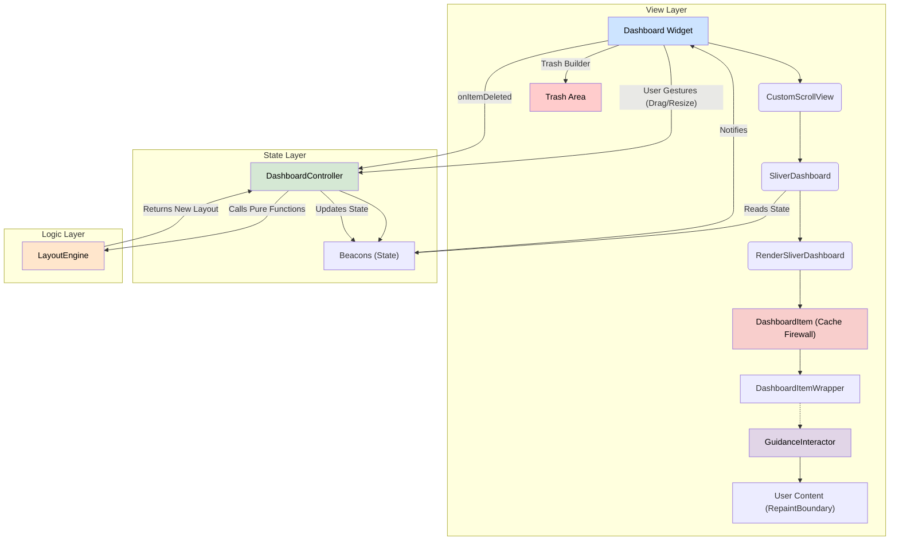
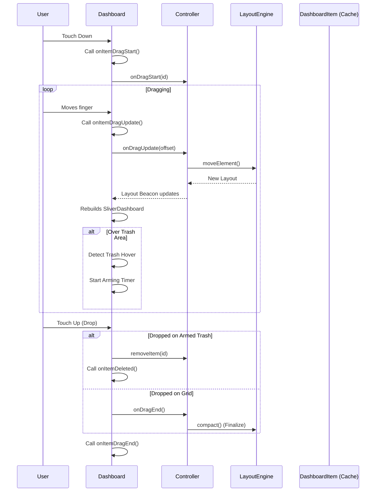

# Architecture of `sliver_dashboard`

This document outlines the architecture of the `sliver_dashboard` package. It is intended for developers who wish to contribute to the project or understand its internal workings.

## Guiding Principles

The architecture is built on a foundation of modern, idiomatic Flutter principles:

1.  **Declarative UI:** The view layer is a direct representation of the state. We never manually manipulate widgets.
2.  **Reactive State Management:** State is centralized in a controller and exposed as reactive streams (`Beacons`). The UI listens to these streams and rebuilds automatically.
3.  **Separation of Concerns:** The codebase is cleanly divided into three distinct layers: State, Logic, and View.
4.  **Performance First:**
    *   **Virtualization:** The core view is built on Flutter's `Sliver` protocol to render only visible items.
    *   **Aggressive Caching:** Individual item widgets are cached and protected from unnecessary rebuilds using a "Firewall" widget strategy.
    *   **Paint Isolation:** Use of `RepaintBoundary` ensures that layout changes (moving an item) do not trigger expensive repaints of the item's content.
5.  **Immutability:** State objects, particularly the `LayoutItem` model, are immutable.

## Core Layers

The package is divided into three main layers, each with a distinct responsibility.

### 1. The State Layer (DashboardController)

- **Location:** `lib/src/controller/dashboard_controller.dart`

- **Responsibility:** To be the single source of truth for the dashboard's state and to expose a clean, public API.

- **Implementation:**
    - Uses `state_beacon` to manage state (layout, edit mode, slot count, etc.).
    - **Drag Offset:** Manages a `dragOffset` beacon to provide smooth visual feedback during drags without committing every pixel change to the logical grid layout.
    - **Orchestrator:** It acts as a bridge. When an action occurs (e.g., `onDragUpdate`), it:
        1. Reads the current state.
        2. Calls the pure `LayoutEngine`.
        3. Updates the beacons with the result.

### 2. The Logic Layer (LayoutEngine)

- **Location:** `lib/src/engine/layout_engine.dart`

- **Responsibility:** To perform all pure, CPU-intensive layout calculations.

- **Implementation:**
    - A library of top-level, pure functions (e.g., `compact`, `moveElement`, `resizeItem`).
    - **Decoupled:** Has no knowledge of Flutter widgets or the controller. Operates purely on the `LayoutItem` data model.
    - **Deterministic:** Given the same input layout and parameters, it always returns the same output layout.

### 3. The View Layer (Dashboard & SliverDashboard)

- **Location:** `lib/src/view/`

- **Responsibility:** To render the state efficiently and handle user gestures.

#### Performance Optimization Strategy

The biggest challenge in a grid layout is preventing the reconstruction of child widgets when the parent layout changes (e.g., resizing the window or dragging an item). `sliver_dashboard` solves this using a multi-level caching strategy:

1.  **`DashboardItem` (The Firewall):**
    - A `StatefulWidget` that wraps every item in the grid.
    - It maintains a cache of the built widget subtree.
    - **Smart Invalidation:** In `didUpdateWidget`, it compares the `contentSignature` of the new item vs. the old item.
        - `contentSignature` is a hash of properties that affect *content* (width, height, id, static status).
        - **Crucially**, it *ignores* position changes (`x`, `y`) and the `itemBuilder` closure instance.
    - If the signature matches, it returns the **exact same widget instance** from its cache. Flutter detects `oldWidget == newWidget` and stops the rebuild propagation immediately.

2.  **Lazy Loading:**
    - The cache is initialized lazily in the `build()` method (not `initState`). This ensures that `InheritedWidgets` (like `Theme`, `Provider`, or `LiteRefScope`) are accessible during the first build.

3.  **`RepaintBoundary`:**
    - The cached widget tree includes a `RepaintBoundary` wrapping the user's content.
    - When an item is moved (layout update), the GPU can simply translate the existing texture without repainting the pixels of the child widget.

#### Key Components

- **Dashboard (StatefulWidget):**
    - The entry point. Handles `GestureDetector` for pan/long-press.
    - **Responsive Logic:** Handles `breakpoints` internally.
        - **Optimization:** Uses a "Skip Frame" strategy. If the slot count needs to be updated based on width, it schedules the update via `addPostFrameCallback` and returns `SizedBox.shrink()` for the current frame. This prevents building the heavy grid twice (once with wrong slots, once with correct slots).
    - Converts pixel coordinates to grid coordinates.
    - Manages the `CustomScrollView`.

- **SliverDashboard & RenderSliverDashboard:**
    - Implements `RenderSliverMultiBoxAdaptor`.
    - **Virtualization:** Only lays out and paints items that are currently visible in the viewport.
    - **Layout:** Calculates the exact pixel position of each item based on its grid coordinates (`x`, `y`) and the slot size.
    - **Layout Protocol (Critical):** The `performLayout` method manages a **doubly linked list** of children. It strictly follows this sequence to ensure stability:
        1.  **Metrics:** Calculate slot sizes.
        2.  **Garbage Collection:** Remove invisible children *before* insertion to clear invalid references.
        3.  **Initial Child:** Find and insert the first visible item.
        4.  **Fill Trailing/Leading:** Insert remaining visible items outwards from the initial child.

- **DashboardItemWrapper:**
    - Adds visual decorations needed for editing, such as the Resize Handles.
    - Wraps the content in a `GuidanceInteractor` if guidance is enabled.
    - It is part of the cached subtree within `DashboardItem`.

- **GuidanceInteractor:**
    - Handles hover (desktop) and tap/long-press (mobile) events to display contextual guidance messages.
    - Manages gesture conflicts on mobile to ensure drag operations are not blocked.

## 4. Core Technical Patterns

### Coordinate Separation
The system strictly separates logical grid coordinates from visual pixel coordinates to maintain precision.
- **Engine:** Operates strictly in **Grid Coordinates** (`int x, y`). It never sees pixel values.
- **View:** Handles translation to **Pixel Coordinates** (`double offset`) using `SlotMetrics`.

### Transactional Drag State (Anti-Drift)
To prevent floating-point rounding errors and position "drift" during drag operations:
- The controller stores the `originalLayoutOnStart` when a gesture begins.
- Every `onDragUpdate` calculates the new position relative to this **initial state**, not the previous frame's state.
- The `dragOffset` beacon handles the smooth visual translation (pixels) separately from the logical grid updates (integers).

### Feedback Layering
When an item is being dragged:
1.  **Grid:** The actual item in the grid acts as a placeholder (or is hidden/transparent).
2.  **Overlay:** A visual copy of the item is rendered in a dedicated `Stack` above the `CustomScrollView`.
3.  **Synchronization:** The overlay follows the finger/mouse, while the grid placeholder snaps to the nearest valid slot.

#### Data Flow during a Drag Operation

