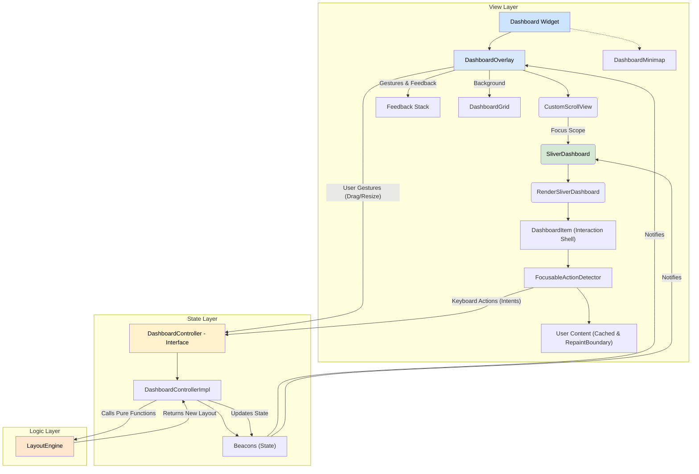
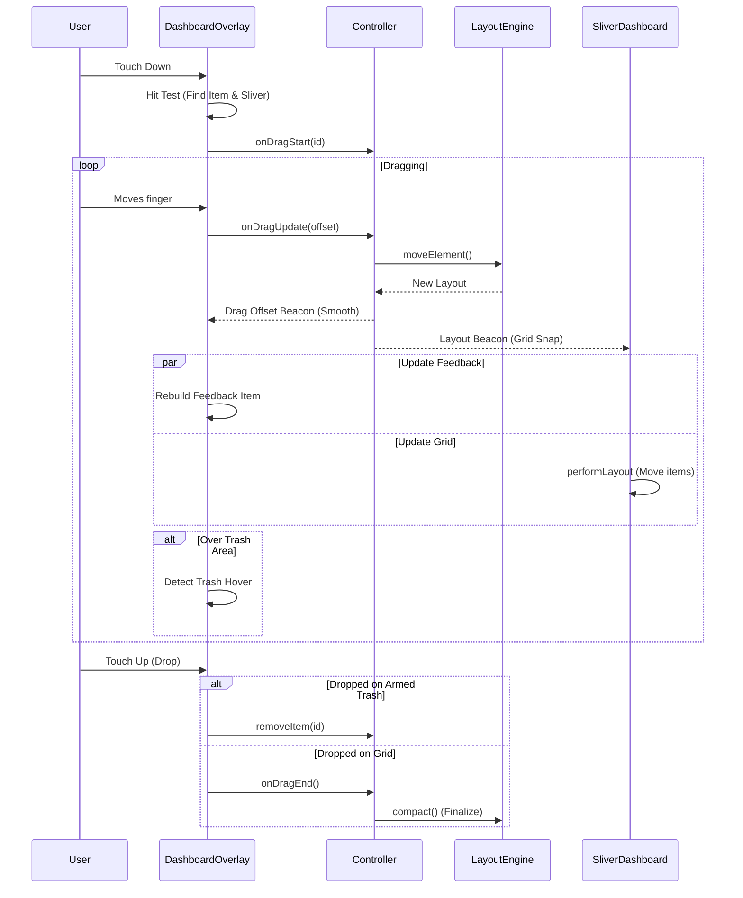

# Architecture of `sliver_dashboard`

This document outlines the architecture of the `sliver_dashboard` package. It is intended for developers who wish to contribute to the project or understand its internal workings.

## Guiding Principles

The architecture is built on a foundation of modern, idiomatic Flutter principles:

1.  **Declarative UI:** The view layer is a direct representation of the state. We never manually manipulate widgets.
2.  **Reactive State Management:** State is centralized in a controller and exposed as reactive streams (`Beacons`). The UI listens to these streams and rebuilds automatically.
3.  **Separation of Concerns:** The codebase is cleanly divided into three distinct layers: State, Logic, and View.
4.  **Performance First:**
    *   **Virtualization:** The core view is built on Flutter's `Sliver` protocol to render only visible items.
    *   **Aggressive Caching:** Individual item widgets are cached and protected from unnecessary rebuilds using a "Firewall" widget strategy.
    *   **Paint Isolation:** Use of `RepaintBoundary` ensures that layout changes (moving an item) do not trigger expensive repaints of the item's content.
5.  **Immutability:** State objects, particularly the `LayoutItem` model, are immutable.
6.  **Accessibility (A11y):** The dashboard is designed to be fully usable via keyboard and screen readers, treating accessibility as a first-class citizen, not an afterthought.

## Core Layers

The package is divided into three main layers, each with a distinct responsibility.

### 1. The State Layer (DashboardController)

- **Location:** `lib/src/controller/`
- **Responsibility:** To be the single source of truth for the dashboard's state and to expose a clean, public API.
- **Implementation:**
    - **Interface Separation:** The public `DashboardController` is an abstract interface. The logic resides in `DashboardControllerImpl`.
    - **Multi-Selection State:** Manages `selectedItemIds` (Set) and `isDragging` (bool). The concept of "Active Item" is derived: it is the **Pivot** during a drag, or the primary selection otherwise.
    - **Drag Offset:** Manages a `dragOffset` beacon to provide smooth visual feedback during drags without committing every pixel change to the logical grid layout.
    - **Orchestrator:** It acts as a bridge. When an action occurs (e.g., `onDragUpdate` or `moveActiveItemBy`). It calculates the delta based on the **Pivot Item** and applies it to the entire cluster via the Engine.
        1. Reads the current state.
        2. Calls the pure `LayoutEngine`.
        3. Updates the beacons with the result.

### 2. The Logic Layer (LayoutEngine)

- **Location:** `lib/src/engine/layout_engine.dart`
- **Responsibility:** To perform all pure, CPU-intensive layout calculations.
- **Implementation:**
    - A library of top-level, pure functions (e.g., `compact`, `moveElement`, `resizeItem`).
    - **Decoupled:** Has no knowledge of Flutter widgets or the controller. Operates purely on the `LayoutItem` data model.
    - **Deterministic:** Given the same input layout and parameters, it always returns the same output layout.
    - **Cluster Logic:** Handles group movements by calculating a **Bounding Box** for selected items. The engine moves this virtual box against obstacles and applies the resulting delta to all items in the cluster.

### 3. The View Layer (Overlay & Slivers)

- **Location:** `lib/src/view/`
- **Responsibility:** To render the state efficiently, handle user gestures, and manage focus/accessibility.

The view layer has been refactored to support native Sliver composition. It is composed of three key widgets:

#### A. `DashboardOverlay` (The Interaction Layer)
- **Role:** Handles all pointer interactions (Gestures), visual feedback (Drag placeholders, Resize handles), Auto-scrolling, and the Trash bin.
- **Placement:** It must wrap the `CustomScrollView`.
- **Logic:**
    - **Global Key:** Uses a unique `GlobalKey` on its internal `Stack` to strictly identify the viewport boundaries for hit-testing and auto-scrolling.
    - **Matrix Transformation:** Uses `renderSliver.getTransformTo(overlay)` to calculate the exact pixel position of the grid, ensuring perfect synchronization between the feedback item and the grid, even inside nested scrolling views.
    - **Overlap-Aware Clipping:** dynamically calculates a `ClipRect` for the feedback item that respects `SliverConstraints.overlap` (e.g., sliding under a pinned `SliverAppBar`).

#### B. `SliverDashboard` (The Rendering Layer)
- **Role:** Renders the actual items within the scroll view using the Sliver protocol.
- **Logic:**
    - **Focus Scope (Parent):** The parent `Dashboard` widget wraps the `CustomScrollView` in a `FocusTraversalGroup` with `OrderedTraversalPolicy` to ensure Tab navigation follows the visual grid logic (Row-major order).
    - **Responsive Logic:** Handles `breakpoints` internally using "Skip Frame" optimization.
    - **Item Persistence:** Unlike standard drag-and-drop lists, items being dragged are **NOT removed** from the tree. They are rendered with `Opacity(0.0)`. This is crucial to preserve their `FocusNode` state during keyboard interactions.

#### C. `RenderSliverDashboard` (The Engine Room)
- **Role:** Implements `RenderSliverMultiBoxAdaptor` to perform the actual layout and painting.
- **Virtualization:** Only lays out and paints items that are currently visible in the viewport.
- **Layout Protocol (Critical):** The `performLayout` method manages a **doubly linked list** of children. It strictly follows this sequence to ensure stability:
    1.  **Metrics:** Calculate slot sizes based on constraints and aspect ratio.
    2.  **Garbage Collection:** Remove invisible children *before* insertion to clear invalid references.
    3.  **Initial Child:** Find and insert the first visible item based on scroll offset.
    4.  **Fill Trailing/Leading:** Insert remaining visible items outwards from the initial child.

#### D. `DashboardItem` (The Smart Wrapper)
- **Role:** The atomic unit of the grid. It handles Caching, Focus, Accessibility, and Visual Decoration.
- **Structure:**
    - **Outer Shell:** `FocusableActionDetector` handling keyboard shortcuts and focus states. Rebuilt on state changes (Focus/Grab).
    - **Inner Core:** Cached User Content wrapped in `RepaintBoundary`.

#### E. Internal Components
- **`DashboardItemWrapper`:**
    - **Role:** The final visual layer before the user's content.
    - **Logic:** Adds visual decorations needed for editing, such as the **Resize Handles**.
    - **Integration:** Wraps the content in a `GuidanceInteractor` if guidance is enabled.
- **`GuidanceInteractor`:**
    - **Role:** Handles contextual user guidance.
    - **Logic:** Detects hover (desktop) and tap/long-press (mobile) events to display contextual guidance messages.
    - **Conflict Management:** Manages gesture conflicts on mobile to ensure drag operations are not blocked.

#### F. DashboardMinimap (Visualization Tool)
- **Role:** Provides a "bird's-eye view" of the entire dashboard layout and the current viewport.
- **Rendering:** Uses a CustomPainter for high performance. It does not render widgets for items but draws rectangles directly on the canvas.
- **Scaling:** Automatically scales the logical grid dimensions to fit the widget's constraints while maintaining the aspect ratio.
- **Interaction:** Supports "Scrubbing" (Tap/Drag) to instantly scroll the dashboard to a specific position. It calculates the inverse ratio (Minimap Pixel -> Scroll Offset) to perform the jump.

## 4. Accessibility Architecture

The package implements a comprehensive A11y strategy based on Flutter's `Actions` and `Intents`.

- **Intents:** Abstract user intentions (`DashboardGrabItemIntent`, `DashboardMoveItemIntent`, `DashboardDropItemIntent`).
- **Shortcuts:** A configurable map binding keys to Intents (e.g., `Space` -> `Grab`, `Arrows` -> `Move`). This is customizable via `DashboardShortcuts`.
- **Actions:** The logic executed when an Intent is triggered. These call the Controller methods (`moveActiveItemBy`, `cancelInteraction`).
- **Announcements:** Integration with `SemanticsService` to announce state changes (Selection, Movement coordinates) to screen readers. Messages are customizable via `DashboardGuidance`.

## 5. Performance Optimization Strategy

The biggest challenge in a grid layout is preventing the reconstruction of child widgets when the parent layout changes (e.g., resizing the window or dragging an item). `sliver_dashboard` solves this using a **Smart Caching** strategy:

1.  **Content Isolation (The Firewall):**
    - The expensive part (the user's widget provided via `itemBuilder`) is cached in a local state `_cachedWidget`.
    - **Smart Invalidation:** In `didUpdateWidget`, the system compares the `contentSignature` of the new item vs. the old item.
        - **Rule:** `contentSignature` is a hash of properties that affect *content* (width, height, id, static status) and **crucially ignores** position changes (`x`, `y`).
    - If the signature matches, the cached widget instance is returned. Flutter detects `oldWidget == newWidget` and stops the rebuild propagation immediately.

2.  **Lazy Loading:**
    - **Rule:** The cache is initialized lazily in the `build()` method (not `initState`). This ensures that `InheritedWidgets` (like `Theme` or `Provider`) are accessible during the first build, preventing runtime errors.

3.  **Shell Reconstruction:**
    - The "Interaction Shell" (border, focus detector, semantics) is rebuilt frequently (e.g., when gaining focus or being grabbed).
    - Because the heavy user content is cached and wrapped in `RepaintBoundary`, rebuilding the shell is extremely cheap (sub-millisecond).

4.  **RepaintBoundary:**
    - When an item moves, the cached widget tree includes a `RepaintBoundary` wrapping the user's content. The GPU simply translates the existing texture without repainting the pixels of the child widget.

## 6. Core Technical Patterns

### Coordinate Separation
The system strictly separates logical grid coordinates from visual pixel coordinates to maintain precision.
- **Engine:** Operates strictly in **Grid Coordinates** (`int x, y`). It never sees pixel values.
- **View:** Handles translation to **Pixel Coordinates** (`double offset`) using `SlotMetrics`.

### Matrix-Based Coordinate Mapping
To support complex Sliver compositions (e.g., inside a `CustomScrollView` with `SliverAppBar`, `SliverPadding`, etc.), we do not rely on simple offset addition.
- `DashboardOverlay` obtains the **Transformation Matrix** between the `RenderSliverDashboard` and the overlay root.
- This accounts for scroll offsets, overlaps, and parent transforms precisely.

### Transactional Drag State (Anti-Drift)
To prevent floating-point rounding errors and position "drift" during drag operations:
- The controller stores the `originalLayoutOnStart` when a gesture begins.
- Every `onDragUpdate` calculates the new position relative to this **initial state**.
- The `dragOffset` beacon handles the smooth visual translation (pixels) separately from the logical grid updates.

### Feedback Layering & Clipping
When an item is being dragged:
1.  **Grid:** The actual item stays in the tree but is made invisible (`Opacity 0`) to keep its FocusNode alive.
2.  **Overlay:** A visual copy (Feedback) is rendered in the `DashboardOverlay` stack.
3.  **Clipping:** The feedback item is clipped using a `ClipRect` calculated from the Sliver's `overlap` constraint. This ensures the item appears to slide "under" pinned headers like an AppBar, rather than floating over them.

### Feedback Layering
When an item is being dragged:
1.  **Grid:** The actual items stay in the tree but are made invisible (`Opacity 0`) to keep their FocusNodes alive.
2.  **Overlay (Cluster):** The Overlay renders a `Stack` containing visual copies of **all selected items**. They are positioned relative to the **Pivot Item** (the one under the cursor) to maintain their formation.
3.  **Synchronization:** The overlay follows the finger/mouse, while the grid placeholder snaps to the nearest valid slot.

### Minimap Rendering Strategy

To efficiently render large grids (1000+ items) in a small widget:
- **No Widgets:** The minimap does not build a widget tree for items.
- **Pure Painting:** It iterates over the LayoutItem list and draws RRects on a single Canvas.
- **Viewport Sync:** It listens to the ScrollController to draw a "Viewport Indicator" that represents the currently visible area, updating at 60fps during scrolls.

#### Data Flow during a Drag Operation

