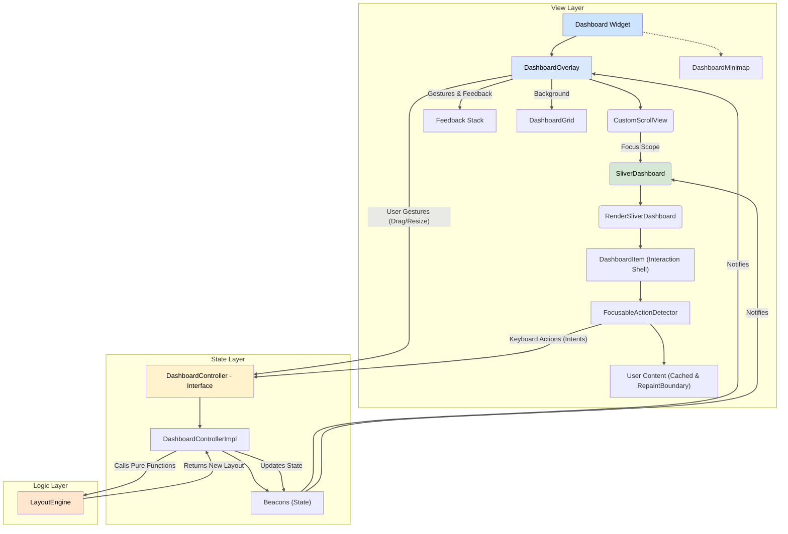
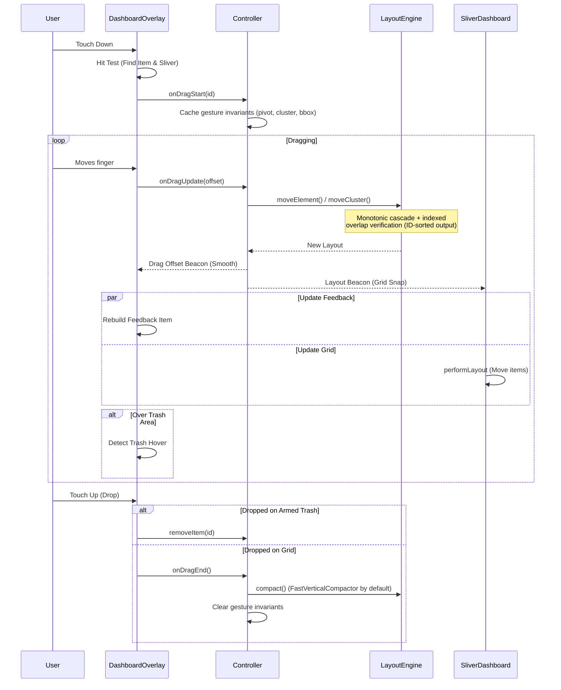
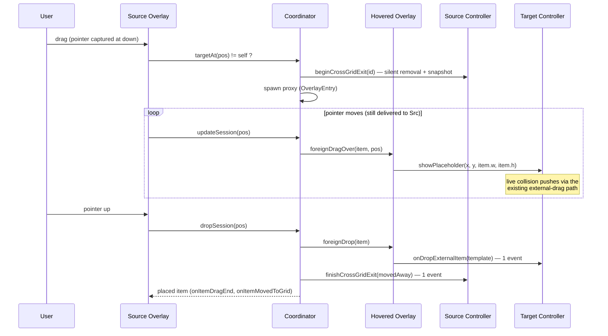

# Architecture of `sliver_dashboard`

This document outlines the architecture of the `sliver_dashboard` package. It is intended for developers who wish to contribute to the project or understand its internal workings.

## Guiding Principles

The architecture is built on a foundation of modern, idiomatic Flutter principles:

1.  **Declarative UI:** The view layer is a direct representation of the state. We never manually manipulate widgets.
2.  **Reactive State Management:** State is centralized in a controller and exposed as reactive streams (`Beacons`). The UI listens to these streams and rebuilds automatically.
3.  **Separation of Concerns:** The codebase is cleanly divided into three distinct layers: State, Logic, and View.
4.  **Performance First:**
    *   **Virtualization:** The core view is built on Flutter's `Sliver` protocol to render only visible items.
    *   **Aggressive Caching:** Individual item widgets are cached and protected from unnecessary rebuilds using a "Firewall" widget strategy.
    *   **Paint Isolation:** Use of `RepaintBoundary` ensures that layout changes (moving an item) do not trigger expensive repaints of the item's content.
    *   **Allocation Discipline:** Per-frame hot paths (drag updates, `performLayout`, minimap paints) must be allocation-free or use reusable scratch buffers. New allocations in these paths are treated as regressions.
5.  **Immutability:** State objects, particularly the `LayoutItem` model, are immutable.
6.  **Accessibility (A11y):** The dashboard is designed to be fully usable via keyboard and screen readers, treating accessibility as a first-class citizen, not an afterthought.

## Core Layers

The package is divided into three main layers, each with a distinct responsibility.

```mermaid
graph TD
    subgraph View Layer
        A[Dashboard Widget] --> B[DashboardOverlay];
        B --> C(CustomScrollView);
        B -- "Gestures & Feedback" --> F[Feedback Stack];
        B -- "Background" --> BG[DashboardGrid];
        C -- "Focus Scope" --> D(SliverDashboard);
        D --> E(RenderSliverDashboard);
        E --> I["DashboardItem (Interaction Shell)"];
        I --> K["FocusableActionDetector"];
        K --> L["User Content (Cached & RepaintBoundary)"];
        A -.-> MM[DashboardMinimap];
    end

    subgraph State Layer
        M[DashboardController - Interface] --> N[DashboardControllerImpl]
        N --> O["Beacons (State)"];
    end

    subgraph Logic Layer
        P[LayoutEngine];
    end

    B -- "User Gestures (Drag/Resize)" --> M;
    K -- "Keyboard Actions (Intents)" --> M;
    N -- Updates State --> O;
    O -- Notifies --> B;
    O -- Notifies --> D;
    N -- Calls Pure Functions --> P;
    P -- Returns New Layout --> N;

    style A fill:#cde4ff,color:#000000
    style B fill:#dae8fc,color:#000000
    style D fill:#d5e8d4,color:#000000
    style M fill:#fff2cc,color:#000000
    style P fill:#ffe6cc,color:#000000
    
    linkStyle default stroke:#555555,stroke-width:2px;
```

### 1. The State Layer (DashboardController)

- **Location:** `lib/src/controller/`
- **Responsibility:** To be the single source of truth for the dashboard's state and to expose a clean, public API.
- **Implementation:**
    - **Interface Separation:** The public `DashboardController` is an abstract interface. The logic resides in `DashboardControllerImpl`.
    - **Multi-Selection State:** Manages `selectedItemIds` (Set) and `isDragging` (bool). The concept of "Active Item" is derived: it is the **Pivot** during a drag, or the primary selection otherwise.
    - **Drag Offset:** Manages a `dragOffset` beacon to provide smooth visual feedback during drags without committing every pixel change to the logical grid layout.
    - **Default Compactor:** The controller defaults to `FastVerticalCompactor` (skyline algorithm, O(N·k)). The legacy `VerticalCompactor` (O(N²·R): measured 1.99M collision checks + 500k list scans per drop at N=1000) remains available via `setCompactor` for behavioral compatibility, but is never the default.
    - **Drag-Start Invariant Caching:** Everything constant for the duration of a gesture (pivot's original item, the dragged cluster's items, the cluster bounding box) is computed **once** in `onDragStart`, cached, and cleared in `onDragEnd` / `cancelInteraction`. `onDragUpdate` must never recompute per-event what is invariant per-gesture.
    - **Cross-Grid Exit Transaction:** `beginCrossGridExit(ids)` removes items *silently* (temporary removal: internal drag state reset, **no `onLayoutChanged`** — the gesture is still in flight) and snapshots the pre-drag layout. `finishCrossGridExit(outcome:)` resolves it three ways: `movedAway` (commit + exactly one `onLayoutChanged`), `returned` (discard silently — the re-insert path already emitted the final layout), `canceled` (restore the snapshot silently). This guarantees observers see **one event per affected grid, at drop time**.
    - **Template-Preserving External Drop:** `onDropExternalItem(template:)` finalizes a placeholder into a full `LayoutItem`, preserving id, min/max constraints and flags (`onDropExternal` only carries an id). `setItemSize(id, w:, h:)` provides clamped programmatic resizing (used by `sizeToContent`).
    - **`hoveredNestTargetId` beacon:** drives the `subGridDynamic` host highlight; watched only by the light item shells (content stays behind its `RepaintBoundary`).
    - **Orchestrator:** It acts as a bridge. When an action occurs (e.g., `onDragUpdate` or `moveActiveItemBy`). It calculates the delta based on the **Pivot Item** and applies it to the entire cluster via the Engine.
        1. Reads the current state.
        2. Calls the pure `LayoutEngine`.
        3. Updates the beacons with the result.

### 2. The Logic Layer (LayoutEngine)

- **Location:** `lib/src/engine/layout_engine.dart`
- **Responsibility:** To perform all pure, CPU-intensive layout calculations.
- **Implementation:**
    - A library of top-level, pure functions (e.g., `compact`, `moveElement`, `resizeItem`).
    - **Decoupled:** Has no knowledge of Flutter widgets or the controller. Operates purely on the `LayoutItem` data model.
    - **Deterministic:** Given the same input layout and parameters, it always returns the same output layout.
    - **Cluster Logic:** Handles group movements by calculating a **Bounding Box** for selected items. The engine moves this virtual box against obstacles and applies the resulting delta to all items in the cluster.
    - **Strategy Pattern:** Compaction logic is delegated to a `CompactorDelegate`. Default implementations (`VerticalCompactor`, `HorizontalCompactor`, `FastVerticalCompactor`) are provided, but can be swapped at runtime.
    - **Overlap-Free Invariant:** `moveElement` uses a **monotonic re-push cascade** (items may be re-queued when pushed again, instead of a one-shot `processed` set) followed by an O(N·k) verification pass over a row index (`_RowIndex`). The unconditional O(N²) all-pairs `resolveCollisions` safety net was removed from the per-crossing hot path (499,500 pair checks at N=1000 → ~16,000 indexed checks, 31× fewer). Property (fuzz-tested, 200 seeded dense layouts): **the returned layout contains zero overlapping non-static items.**
    - **Static-Jump Correctness:** When the moved item jumps over a static obstacle, collision resolution restarts from the item's **new** position; stale collision lists computed for the pre-jump position must never be consumed (`break` after re-queue).
    - **Index Stability Invariant:** Every engine function that returns a layout preserves **ascending ID order**, including `moveCluster` (which previously appended the dragged cluster at the tail). Element/widget identity in the sliver depends on this ordering; violating it causes full remount churn (`finalizeTree` / `_InactiveElements._unmount`).
    - **INVARIANT — No Cluster Duplication:** `moveCluster` must guarantee that selecting pure static items alongside dynamic items does not result in duplicated elements in the final layout. Static items are treated as immovable obstacles within the collision path and are naturally returned by the coordinate solver; they must never be appended a second time (avoiding `ValueKey` crashes in the sliver).

### 3. The View Layer (Overlay & Slivers)

- **Location:** `lib/src/view/`
- **Responsibility:** To render the state efficiently, handle user gestures, and manage focus/accessibility.

The view layer has been refactored to support native Sliver composition. It is composed of three key widgets (plus, **[NESTED]**, the nested-grid layer described in §7: `DashboardNestedScope`, `DashboardNestedCoordinator`, `NestedDashboard`):

#### A. `DashboardOverlay` (The Interaction Layer)
- **Role:** Handles all pointer interactions (Gestures), visual feedback (Drag placeholders, Resize handles), Auto-scrolling, and the Trash bin.
- **Placement:** It must wrap the `CustomScrollView`.
- **Logic:**
    - **Global Key:** Uses a unique `GlobalKey` on its internal `Stack` to strictly identify the viewport boundaries for hit-testing and auto-scrolling.
    - **Matrix Transformation:** Uses `renderSliver.getTransformTo(overlay)` to calculate the exact pixel position of the grid, ensuring perfect synchronization between the feedback item and the grid, even inside nested scrolling views.
    - **Overlap-Aware Clipping:** dynamically calculates a `ClipRect` for the feedback item that respects `SliverConstraints.overlap` (e.g., sliding under a pinned `SliverAppBar`).
    - **Web Throttle Flush:** The 16 ms pointer-event throttle used on web keeps the freshest position and flushes it on a short timer, so the item never settles one event behind the cursor at the end of a burst.
    - **`CrossGridDragTarget`:** the overlay state implements this interface so the nested-grid coordinator can drive it (`foreignDragOver`/`foreignDragLeave`/`foreignDrop`, `itemAtGlobal`, `currentSlotMetrics`, highlight). It registers with the nearest `DashboardNestedScope` in `didChangeDependencies` (depth = number of enclosing dashboards) and unregisters on dispose.
    - **Hit-Test Ownership:** `_hitTest` filters hit-path entries by **sliver ownership**. The hit-test path is deepest-first, so with nested grids the first `SliverDashboardParentData` under the pointer may belong to an *inner* grid; without the filter the outer overlay would start a drag on a foreign item id (StateError). Entries from foreign slivers are skipped and the walk naturally reaches the overlay's own host item.
    - **Pointer Claim & Target Exclusions:** on pointer-down, the deepest overlay that actually starts an operation claims the pointer at the coordinator; ancestor overlays check `isPointerClaimedByOther` first and skip (Flutter dispatches pointer events deepest-first, so the claim is always set before ancestors run).
    - **Placeholder Refactor:** `_updatePlaceholderPosition` (the `DragTarget` external-drop path) now delegates to `_gridPointAtGlobal` + `_showPlaceholderAt(w:, h:)`, shared with cross-grid drags so both flows use the exact same geometry and clamping.

#### B. `SliverDashboard` (The Rendering Layer)
- **Role:** Renders the actual items within the scroll view using the Sliver protocol.
- **Logic:**
    - **Focus Scope (Parent):** The parent `Dashboard` widget wraps the `CustomScrollView` in a `FocusTraversalGroup` with `OrderedTraversalPolicy` to ensure Tab navigation follows the visual grid logic (Row-major order).
    - **Responsive Logic:** Handles `breakpoints` internally using "Skip Frame" optimization.
    - **Item Persistence:** Unlike standard drag-and-drop lists, items being dragged are **NOT removed** from the tree. They are rendered with `Opacity(0.0)`. This is crucial to preserve their `FocusNode` state during keyboard interactions.
    - **Identity Guards:** The `items` setter no-ops when the incoming list is `identical` to the current one (the controller emits a new instance only on real layout changes). The Key→Index map is reused whenever the **ID sequence** is unchanged (allocation-free O(N) string-identity walk), instead of rebuilding an N-entry `ValueKey` map on every drag frame.

#### C. `RenderSliverDashboard` (The Engine Room)
- **Role:** Implements `RenderSliverMultiBoxAdaptor` to perform the actual layout and painting.
- **Virtualization:** Only lays out and paints items that are currently visible in the viewport.
- **Zero-Allocation Geometry:** Item geometry is computed into a reusable `Float64List` scratch buffer (`[left, top, width, height]` per item) instead of allocating a `List<Rect>` per layout pass (previously ~60k short-lived `Rect`s per second during autoscroll drags at N=1000, a measurable dart2js minor-GC source).
- **Layout Protocol (Critical):** The `performLayout` method manages a **doubly linked list** of children. It strictly follows this sequence to ensure stability (the buffer change does **not** alter this order):
    1.  **Metrics:** Calculate slot sizes based on constraints and aspect ratio.
    2.  **Garbage Collection:** Remove invisible children *before* insertion to clear invalid references.
    3.  **Initial Child:** Find and insert the first visible item based on scroll offset.
    4.  **Fill Trailing/Leading:** Insert remaining visible items outwards from the initial child.

#### D. `DashboardItem` (The Smart Wrapper)
- **Role:** The atomic unit of the grid. It handles Caching, Focus, Accessibility, and Visual Decoration.
- **Structure:**
    - **Outer Shell:** `FocusableActionDetector` handling keyboard shortcuts and focus states. Rebuilt on state changes (Focus/Grab).
    - **Inner Core:** Cached User Content wrapped in `RepaintBoundary`.
- **Allocation-Free Shell Rebuilds:** The `Actions` map (4 `CallbackAction` closures) is built once per `State` (`late final`); actions read live controller state at invoke time. Shortcut maps are cached per `DashboardShortcuts` config instance (active + idle variants). Shell rebuilds during drags allocate nothing.
- **Keep-Alive Trade-off (documented):** `wantKeepAlive = isDragging` prevents unmount thrash at the cache edge, but during a long autoscroll drag the keep-alive bucket can grow toward N items, released in one `finalizeTree` burst after the drop. If profiling shows this, scope keep-alive to the dragged cluster + recently laid-out items (re-exposes flicker for non-cluster items; gate behind measurement).

#### E. Internal Components
- **`DashboardItemWrapper`:**
    - **Role:** The final visual layer before the user's content.
    - **Logic:** Adds visual decorations needed for editing, such as the **Resize Handles**.
    - **Integration:** Wraps the content in a `GuidanceInteractor` if guidance is enabled.
- **`GuidanceInteractor`:**
    - **Role:** Handles contextual user guidance.
    - **Logic:** Detects hover (desktop) and tap/long-press (mobile) events to display contextual guidance messages.
    - **Conflict Management:** Manages gesture conflicts on mobile to ensure drag operations are not blocked.
- **`GridBackgroundPainter`:** `SlotMetrics` implements value-based `==`/`hashCode` so `shouldRepaint` can short-circuit; the row-line loop is bounded by the clip rect instead of a hard-coded 10,000 px extent (~80–150 mostly-clipped `drawLine` commands per repaint reduced to the visible ~10–20).

#### F. DashboardMinimap (Visualization Tool)
- **Role:** Provides a "bird's-eye view" of the entire dashboard layout and the current viewport.
- **Two-Layer Painting:** The minimap is split into:
    - `_MinimapItemsPainter` behind its own `RepaintBoundary`, repainted **only** when the layout list instance changes, batching all item rects into two `drawPath` calls (previously up to 1000 individual `drawRRect`s per drag cell-crossing);
    - `_MinimapViewportPainter` constructed with `super(repaint: scrollController)`, so the viewport indicator repaints on scroll **without** rebuilding the widget. This also fixes the stale-indicator bug (the indicator previously did not track scrolling because `shouldRepaint` ignored the scroll offset).
- **Scaling:** Automatically scales the logical grid dimensions to fit the widget's constraints while maintaining the aspect ratio.
- **Interaction:** Supports "Scrubbing" (Tap/Drag) to instantly scroll the dashboard to a specific position. It calculates the inverse ratio (Minimap Pixel -> Scroll Offset) to perform the jump.

## 4. Accessibility Architecture

The package implements a comprehensive A11y strategy based on Flutter's `Actions` and `Intents`.

- **Intents:** Abstract user intentions (`DashboardGrabItemIntent`, `DashboardMoveItemIntent`, `DashboardDropItemIntent`).
- **Shortcuts:** A configurable map binding keys to Intents (e.g., `Space` -> `Grab`, `Arrows` -> `Move`). This is customizable via `DashboardShortcuts`.
- **Actions:** The logic executed when an Intent is triggered. These call the Controller methods (`moveActiveItemBy`, `cancelInteraction`). **[AUDIT]** Action instances are per-`State` singletons; they must read live state at invoke time, never capture per-build state.
- **Announcements:** Integration with `SemanticsService` to announce state changes (Selection, Movement coordinates) to screen readers. Messages are customizable via `DashboardGuidance`.

## 5. Performance Optimization Strategy

The biggest challenge in a grid layout is preventing the reconstruction of child widgets when the parent layout changes (e.g., resizing the window or dragging an item). `sliver_dashboard` solves this using a **Smart Caching** strategy:

1.  **Content Isolation (The Firewall):**
    - The expensive part (the user's widget provided via `itemBuilder`) is cached in a local state `_cachedWidget`.
    - **Smart Invalidation:** In `didUpdateWidget`, the system compares the `contentSignature` of the new item vs. the old item.
        - **Rule:** `contentSignature` is a hash of properties that affect *content* (width, height, id, static status) and **crucially ignores** position changes (`x`, `y`).
    - If the signature matches, the cached widget instance is returned. Flutter detects `oldWidget == newWidget` and stops the rebuild propagation immediately.

2.  **Lazy Loading:**
    - **Rule:** The cache is initialized lazily in the `build()` method (not `initState`). This ensures that `InheritedWidgets` (like `Theme` or `Provider`) are accessible during the first build, preventing runtime errors.

3.  **Shell Reconstruction:**
    - The "Interaction Shell" (border, focus detector, semantics) is rebuilt frequently (e.g., when gaining focus or being grabbed).
    - Because the heavy user content is cached and wrapped in `RepaintBoundary`, rebuilding the shell is extremely cheap (sub-millisecond).

4.  **RepaintBoundary:**
    - When an item moves, the cached widget tree includes a `RepaintBoundary` wrapping the user's content. The GPU simply translates the existing texture without repainting the pixels of the child widget.

5.  **Measured Hot-Path Budgets (N=1000, 8 columns, 2×2 items):**
    - Drag cell-crossing: ≤ ~20,000 collision checks total (indexed verification), vs 499,500 all-pairs checks pre-audit. Top-of-grid drags additionally traverse up to ~250 cascade queue steps (bottom: 1) — this asymmetry is inherent to push-based grids and is bounded, not eliminated.
    - Drop compaction (default compactor): O(N·k) skyline; regression threshold in CI: < 50 ms at N=1000 on the test runner.
    - `performLayout`: zero heap allocations besides the (amortized) scratch buffer growth.
    - Minimap during drags: 2 `drawPath` calls for items; viewport indicator repaints only on scroll.

### Performance Budgets & CI Runhead Safety Ceilings

To ensure that the `sliver_dashboard` package maintains a strict 60 FPS target during high-frequency interactions, test suite enforces automated performance budgets.

While local AOT release builds execute these computations in sub-millisecond durations, CI validation thresholds are set to **50ms**, **35ms**, and **15ms** respectively. These values are designed as engineering safety ceilings to absorb system-level execution noise while preventing false positives.

#### Drop Compaction Budget (`< 50ms` for N = 1000 items)
When viewport column boundaries change, the layout organizer must reorganize all elements.
* **The CI Headroom:** Shared virtualized CI runners (e.g., GitHub Actions, GitLab CI) are heavily throttled and non-deterministic. A cold-start JIT execution taking 2ms locally can spike to 15–20ms under shared runner congestion.
* **The Fail-Safe:** Setting the budget to 50ms absorbs virtualized runner noise to **prevent flaky tests** (false positives), yet serves as an immediate circuit breaker: if a contributor accidentally introduces an O(N^2) or O(N^3) algorithm, the computation for 1,000 items will balloon to **250ms–1000ms+**, immediately failing the CI build.

#### Cascade Push Budget (`< 35ms` for N = 500 items)
Moving a cluster into a dense grid triggers a cascading push sequence strictly along column boundaries.
* **OS Clock Resolution Constraints:** On some operating systems (notably Windows runners), the default system clock tick resolution (`Stopwatch`) progresses in discrete steps (tied to the OS kernel interrupt frequency).
* **The Fail-Safe:** Setting the budget to 35ms ensures that OS clock-tick jitter cannot fail the test suite, while validating that row-indexed spatial index (`_RowIndex`) remains active. If the index is broken, the cascade engine falls back to O(N^2) pairs scanning, easily exceeding the 35ms ceiling.

#### Cross-Grid Target Selection Budget (`< 15ms` for N = 1000 items)
While a cross-grid drag is active, the coordinator must resolve which target grid is under the cursor on every pointer move event.
* **The Complexity Guarantee:** The `targetAt` method must maintain O(G) complexity (where G is the number of live grids under the scope) and **never** degrade to O(N) linear scans of all items.
* **The Fail-Safe:** In a dense layout of 1,000 items, an O(N) scan would cause massive CPU spikes on every touch move. A 15ms budget on JIT execution ensures that we are only performing point-in-rect tests on registered overlays, completely bypassing individual item coordinate checks. This guarantees microsecond-level execution in production while remaining resilient to CI runner scheduling overhead.

## 6. Core Technical Patterns

### Coordinate Separation
The system strictly separates logical grid coordinates from visual pixel coordinates to maintain precision.
- **Engine:** Operates strictly in **Grid Coordinates** (`int x, y`). It never sees pixel values.
- **View:** Handles translation to **Pixel Coordinates** (`double offset`) using `SlotMetrics`.

### Matrix-Based Coordinate Mapping
To support complex Sliver compositions (e.g., inside a `CustomScrollView` with `SliverAppBar`, `SliverPadding`, etc.), we do not rely on simple offset addition.
- `DashboardOverlay` obtains the **Transformation Matrix** between the `RenderSliverDashboard` and the overlay root.
- This accounts for scroll offsets, overlaps, and parent transforms precisely.

### Transactional Drag State (Anti-Drift)
To prevent floating-point rounding errors and position "drift" during drag operations:
- The controller stores the `originalLayoutOnStart` when a gesture begins.
- Every `onDragUpdate` calculates the new position relative to this **initial state**.
- The `dragOffset` beacon handles the smooth visual translation (pixels) separately from the logical grid updates.
- **[AUDIT]** Gesture-invariant data (pivot original, cluster, bounding box) is part of this transaction: captured at start, cleared at end/cancel.

### Feedback Layering & Clipping
When an item is being dragged:
1.  **Grid:** The actual item stays in the tree but is made invisible (`Opacity 0`) to keep its FocusNode alive.
2.  **Overlay:** A visual copy (Feedback) is rendered in the `DashboardOverlay` stack.
3.  **Clipping:** The feedback item is clipped using a `ClipRect` calculated from the Sliver's `overlap` constraint. This ensures the item appears to slide "under" pinned headers like an AppBar, rather than floating over them.

### Feedback Layering
When an item is being dragged:
1.  **Grid:** The actual items stay in the tree but are made invisible (`Opacity 0`) to keep their FocusNodes alive.
2.  **Overlay (Cluster):** The Overlay renders a `Stack` containing visual copies of **all selected items**. They are positioned relative to the **Pivot Item** (the one under the cursor) to maintain their formation.
3.  **Synchronization:** The overlay follows the finger/mouse, while the grid placeholder snaps to the nearest valid slot.

### Minimap Rendering Strategy

To efficiently render large grids (1000+ items) in a small widget:
- **No Widgets:** The minimap does not build a widget tree for items.
- **Pure Painting:** Items are batched into a single `Path` per style and drawn behind a `RepaintBoundary`; the viewport indicator is a separate painter bound to the `ScrollController` via the `repaint` listenable.
- **Viewport Sync:** The indicator repaints at scroll rate without touching the items layer.

#### Data Flow during a Drag Operation

```mermaid
sequenceDiagram
    participant User
    participant Overlay as DashboardOverlay
    participant Controller
    participant Engine as LayoutEngine
    participant Sliver as SliverDashboard

    User->>Overlay: Touch Down
    Overlay->>Overlay: Hit Test (Find Item & Sliver)
    Overlay->>Controller: onDragStart(id)
    Controller->>Controller: Cache gesture invariants (pivot, cluster, bbox)

    loop Dragging
        User->>Overlay: Moves finger
        Overlay->>Controller: onDragUpdate(offset)
        Controller->>Engine: moveElement() / moveCluster()
        Note over Engine: Monotonic cascade + indexed<br/>overlap verification (ID-sorted output)
        Engine-->>Controller: New Layout
        Controller-->>Overlay: Drag Offset Beacon (Smooth)
        Controller-->>Sliver: Layout Beacon (Grid Snap)

        par Update Feedback
            Overlay->>Overlay: Rebuild Feedback Item
        and Update Grid
            Sliver->>Sliver: performLayout (Move items)
        end

        alt Over Trash Area
            Overlay->>Overlay: Detect Trash Hover
        end
    end

    User->>Overlay: Touch Up (Drop)

    alt Dropped on Armed Trash
        Overlay->>Controller: removeItem(id)
    else Dropped on Grid
        Overlay->>Controller: onDragEnd()
        Controller->>Engine: compact() (FastVerticalCompactor by default)
        Controller->>Controller: Clear gesture invariants
    end
```

## 7. Nested Grids & Cross-Grid Drag (v2)

A grid item can host a full `Dashboard`,
and a drag can travel continuously between any grids sharing a
`DashboardNestedScope` (parent ↔ child ↔ siblings, any depth).

### Components

- **`DashboardNestedScope`** (`lib/src/view/nested/dashboard_nested_scope.dart`)
  — `StatefulWidget` owning a `DashboardNestedCoordinator`, exposed via an
  `InheritedWidget`. Scope parameters (`onItemMovedToGrid`,
  `onNestedGridRequested`, `subGridDynamic`, `nestHoverDelay`) are the single
  source of truth and are synced onto the coordinator.
- **`DashboardNestedCoordinator`** — the control plane:
    - **Registry & Target Resolution (INVARIANT):** Every `DashboardOverlay` under the scope registers with its nesting **depth**. `targetAt(globalPosition)` resolves the deepest registered grid containing the point — O(G) point-in-rect tests per pointer event (G = live grids), never per item.
      - **Recursive Nesting Safeguard:** `targetAt` prevents a parent grid item from being dragged inside its own child grid or deep descendant subtrees. This lookup uses the authoritative link-registry `_childLinks` (persistent walk-up check `isDescendantOf`) instead of unmounted/virtualized overlay states.
      - **Same-Grid Drag Session Isolation:** Dragging within the source grid remains valid without triggering cross-grid sessions. The source controller itself is not excluded, allowing fluid local movements.
    - **Pointer claim:** `claimPointer` / `isPointerClaimedByOther` prevents
      ancestor grids from stealing drags started in nested grids.
    - **Cross-grid session:** the state machine driving an item's move between grids — temporary 
      removal from the source grid, a live push-preview placeholder in the hovered grid, 
      and the final drop or cancel (see the sequence below). 
      Includes the floating proxy (`OverlayEntry` + `ValueNotifier<Offset>`; requires 
      a Flutter `Overlay` ancestor, gracefully skipped otherwise).
    - **Tree links & stash:** `NestedDashboard` declares parent links
      (`linkChildGrid`); links are recorded in a pending map because a
      `NestedDashboard` mounts *before* the overlay of the grid it hosts, and
      applied at registration. Serialized payloads for grids that are not
      mounted yet are stashed and consumed on mount.
- **`NestedDashboard`** (`lib/src/view/nested/nested_dashboard.dart`) — a
  child `Dashboard` wrapper with `parentItemId`:
    - `autoSlotCount`: child slot count follows the
      host item's `w`, deferred post-frame with an applied-value guard.
    - `sizeToContent`: computes needed child pixels from `SlotMetrics` and asks
      the parent (via `setItemSize`) for the matching host `h`, post-frame,
      loop-guarded, and skipped while the parent grid is mid-gesture.
- **Codec** (`lib/src/view/nested/nested_layout_codec.dart`) —
  `exportNestedTree` / `loadNestedTree`, recursive, `subGrid: {slotCount,
  items}` payloads. Item ids must be unique across the tree.

### Cross-grid drag protocol

```mermaid
sequenceDiagram
    participant User
    participant Src as Source Overlay
    participant Coord as Coordinator
    participant Tgt as Hovered Overlay
    participant SC as Source Controller
    participant TC as Target Controller

    User->>Src: drag (pointer captured at down)
    Src->>Coord: targetAt(pos) != self ?
    Coord->>SC: beginCrossGridExit(id)  — silent removal + snapshot
    Coord->>Coord: spawn proxy (OverlayEntry)
    loop pointer moves (still delivered to Src)
        Src->>Coord: updateSession(pos)
        Coord->>Tgt: foreignDragOver(item, pos)
        Tgt->>TC: showPlaceholder(x, y, item.w, item.h)
        Note over TC: live collision pushes via the<br/>existing external-drag path
    end
    User->>Src: pointer up
    Src->>Coord: dropSession(pos)
    Coord->>Tgt: foreignDrop(item)
    Tgt->>TC: onDropExternalItem(template) — 1 event
    Coord->>SC: finishCrossGridExit(movedAway) — 1 event
    Coord-->>Src: placed item (onItemDragEnd, onItemMovedToGrid)
```

Key properties:

- **Pointer routing:** Flutter delivers all moves/up of a pointer to the
  hit-test path captured at pointer-down, so the **source overlay drives the
  whole session** even when the cursor is over another grid. The coordinator
  only routes.
- **Symmetric origin re-entry:** once an item has exited, every grid —
  including its origin — is handled through the same placeholder flow;
  dropping back home resolves with `returned` (snapshot discarded silently,
  the drop already emitted the final layout).
- **Cancel:** releasing over no grid restores the source's pre-drag snapshot
  (single silent restore, no events).
- **Single item:** cross-grid drags carry exactly one item;
  multi-selection drags stay within their grid.
- **`subGridDynamic`:** hovering a plain item freezes the placeholder
  (pushes reverted so the host stays under the cursor — hover detection runs
  against the pre-push `originalLayoutOnStart` snapshot), highlights the host
  via `hoveredNestTargetId`, and fires `onNestedGridRequested` after
  `nestHoverDelay`.
- **`subGridDynamicSameGrid`:** the in-grid twin of the above, living in the
  *overlay* (not the coordinator — it runs before any session exists). A
  pointer-pause timer (350 ms, restarted on every move; pointer events stop
  when the pointer stops, so a timer is the only way to observe the pause)
  fires `_armSameGridNest`: hit-test against `dragOriginSnapshot` (the pushed
  layout lies about what is hovered), `freezeDragPushes()` on the impl
  (restores the snapshot, keeps the drag alive, and resets the bbox-bypass
  cache so resuming re-applies the pushes), highlight, then the shared
  `nestHoverDelay` arming. Release-while-frozen performs one final
  `_performUpdate`, which — if the host was just converted — starts the
  regular cross-grid session into the new child grid and the existing
  pointer-up branch finalizes it as a drop. Pause detection is
  jitter-anchored (restarted only on >8px movement — trackpads emit
  sub-pixel noise continuously) and stops the edge auto-scroll at arming
  (its 16ms tick re-runs `_performUpdate` and would fight the freeze).
- **Pending nest request:** both arming paths record the fired request on
  the coordinator (`notifyNestRequestFired`) and it is resolved exactly once
  at drag end (`resolveNestRequest`): `dropSession` resolves with the
  receiving controller, `cancelSession` and the plain pointer-up (guarded by
  the overlay's had-active-drag flag) resolve with null. Unless the item
  landed in `childGridsOf(hostGrid)[host.id]`, `onNestedGridRequestAbandoned`
  fires so the app can revert its speculative conversion. The pending record
  deliberately survives `beginSession`: the handoff into the freshly created
  child grid happens *through* a session, and only the drop that ends it can
  confirm the request.
- **`maxNestingDepth` gates level *creation*, not item movement:** the cap is checked in `updateSession` (only when the dragged item `hasNestedGrid`, i.e. it would add a level) and in `subGridDynamic` arming (via `canHostAtDepth(reg.depth)`). Do not add a blanket depth filter to `targetAt` — that would wrongly block plain leaf moves into deep grids. `moveItemToGrid` stays unconstrained (explicit caller).
- **`hasNestedGrid` is declarative, links are authoritative:** the flag marks intent (builders, persistence, policies) and is self-healed by the codec (set on export for linked hosts, normalized on import from `subGrid` payloads); runtime decisions (`hasChildGrid`, export recursion, delivery) must keep reading the coordinator's persistent `_childLinks` map. The flag participates in `==`/`hashCode`/`contentSignature` — any change to it must keep the equality-law tests green.
- **`updateItem` is the single-item mutation entry point:** never rewrite `layout.value` by hand to change one item. `updateItem` enforces id identity, corrects bounds, no-ops on unknown id / equal result, and emits one `onLayoutChanged`. New per-item mutations should go through it (or a thin wrapper over it), not around it.
- **Id uniqueness:** cross-grid moves and the tree codec assume item ids are unique across the whole tree (debug-asserted in `moveItemToGrid`). Document this on any new cross-grid API.

### Performance contract

- Without a `DashboardNestedScope`: three null-checks per pointer event, zero
  allocations, zero registry.
- With a scope: `targetAt` is O(G) per pointer event; a cross-grid hover runs
  the pre-existing `showPlaceholder` path on the hovered grid (same cost as
  the shipped `DragTarget` flow, on the audited skyline compactor); the proxy
  repositions via one `ValueNotifier` without rebuilding any grid.
- Layering is preserved: the engine is untouched; controller additions are
  pure state/orchestration; all geometry stays in the view layer.
